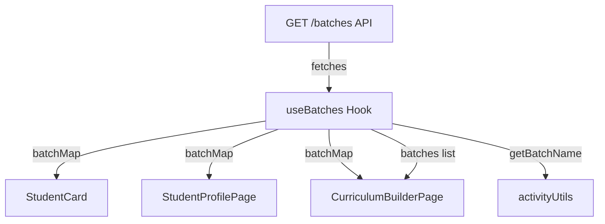
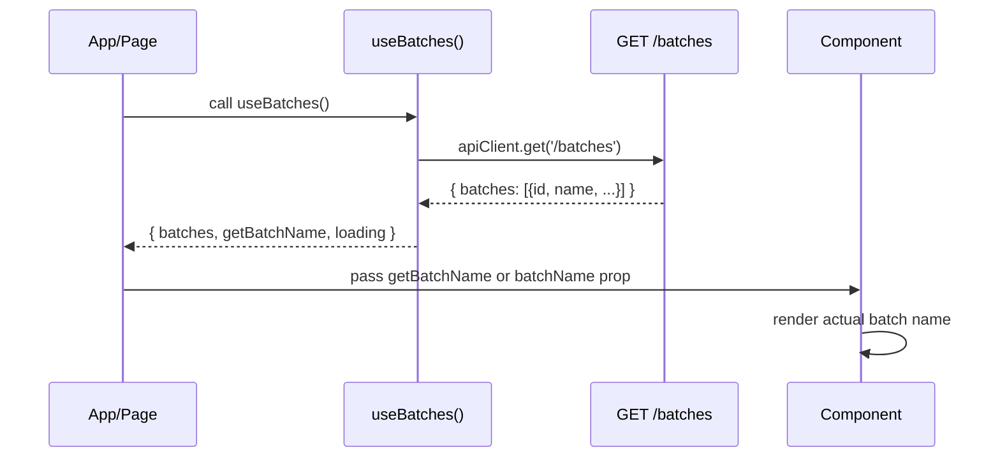

# Design Document: Batch Name Display Fix

## Overview

The ShuttleCoach frontend displays raw batch IDs (UUID fragments like "Batch aaaa", "Batch 001") instead of human-readable batch names across four screens: Dashboard student cards, Recent Activity feed, Student Profile header, and Curriculum Builder batch dropdown.

The root cause is that the `Student` type only carries `batchId` (a UUID), and the frontend uses `batchId.split('-')[1]` to display a truncated ID rather than resolving the actual batch name. The API's `/batches` endpoint already returns `{ id, name, ... }` — the fix creates a shared batch lookup mechanism that resolves IDs to names across all affected components.

## Architecture

The fix introduces a `useBatches` hook that fetches all batches once from the existing `GET /batches` API endpoint and exposes a lookup function `getBatchName(batchId)`. All affected components and utilities consume this hook or accept a batch name resolver as a parameter.





## Components and Interfaces

### Component 1: useBatches Hook

**Purpose**: Fetches all batches from the API and provides a lookup map from batch ID to batch name. Single source of truth for batch name resolution.

**Interface**:
```typescript
interface UseBatchesReturn {
  batches: Batch[];
  loading: boolean;
  error: string | null;
  getBatchName: (batchId: string | undefined) => string;
  refetch: () => Promise<void>;
}

function useBatches(): UseBatchesReturn;
```

**Responsibilities**:
- Fetch batches from `GET /batches` on mount
- Build an internal `Map<string, string>` (batchId → batchName)
- Provide `getBatchName(batchId)` that returns the name or a fallback
- Handle loading and error states
- Cache results for the component lifecycle

### Component 2: StudentCard (modified)

**Purpose**: Display student information including the resolved batch name.

**Interface change**:
```typescript
interface StudentCardProps {
  student: Student;
  batchName?: string;       // NEW: resolved batch name
  onClick?: () => void;
  isDueForReview?: boolean;
  daysOverdue?: number;
}
```

**Responsibilities**:
- Render `batchName` prop when provided instead of `student.batchId.split('-')[1]`
- Fall back to "Unknown batch" if neither batchName nor batchId is available

### Component 3: activityUtils (modified)

**Purpose**: Generate activity feed descriptions using resolved batch names.

**Interface change**:
```typescript
function generateActivityFeed(
  assessments: SkillAssessment[],
  trainingLogs: TrainingLog[],
  students: Student[],
  limit?: number,
  getBatchName?: (batchId: string | undefined) => string  // NEW parameter
): Activity[];
```

**Responsibilities**:
- Use `getBatchName` to resolve batch names in "student joined" activity descriptions
- Fall back to existing behavior if `getBatchName` is not provided (backward compatibility)

### Component 4: StudentProfilePage (modified)

**Purpose**: Display student profile header with resolved batch name.

**Responsibilities**:
- Use `useBatches()` hook to get `getBatchName`
- Replace `student.batchId.split('-')[1]` with `getBatchName(student.batchId)`

### Component 5: CurriculumBuilderPage (modified)

**Purpose**: Populate batch dropdown with actual batch names.

**Responsibilities**:
- Use `useBatches()` hook to get the full batches list
- Replace the local `uniqueBatches` construction from student batchIds with the API-fetched batches list
- Display `batch.name` in the dropdown instead of `Batch ${batchId.split('-')[1]}`

## Data Models

### Model: Batch (existing, unchanged)

```typescript
interface Batch {
  id: string;
  name: string;
  schedule: string;
  assignedCoachId?: string;
  studentCount: number;
  createdAt: Date;
}
```

### Model: Batch API Response

```typescript
interface BatchesApiResponse {
  batches: Array<{
    id: string;
    name: string;
    schedule: string;
    assignedCoachId: string | null;
    coachName: string | null;
    createdAt: string;
    updatedAt: string;
  }>;
}
```

**Validation Rules**:
- `id` is always a non-empty UUID string
- `name` is always a non-empty string (the actual human-readable name)
- The API already returns this format from `GET /batches`

## Error Handling

### Error Scenario 1: Batches API Unavailable

**Condition**: `GET /batches` returns a network error or 5xx status
**Response**: `useBatches` sets `error` state and returns empty batches list
**Recovery**: `getBatchName()` returns a graceful fallback string ("Unknown batch") rather than crashing. Components remain functional with degraded display.

### Error Scenario 2: Batch ID Not Found in Lookup

**Condition**: A student has a `batchId` that doesn't exist in the fetched batches list (e.g., batch was deleted)
**Response**: `getBatchName()` returns "Unknown batch" as a safe fallback
**Recovery**: No crash, user sees a clear indication that the batch is unresolved

### Error Scenario 3: Batch ID is undefined/null

**Condition**: Student has no batch assigned (`batchId` is undefined)
**Response**: Components skip rendering the batch label entirely (existing behavior preserved)
**Recovery**: N/A — this is valid state

## Testing Strategy

### Unit Testing Approach

- Test `useBatches` hook: mock API response, verify `getBatchName` returns correct names
- Test `getBatchName` with valid IDs, unknown IDs, and undefined
- Test `StudentCard` renders batch name from prop instead of truncated ID
- Test `activityUtils.generateActivityFeed` uses getBatchName when provided
- Verify backward compatibility when getBatchName is omitted

### Integration Testing Approach

- Verify Dashboard page passes resolved batch names to StudentCard
- Verify StudentProfilePage shows actual batch name in header
- Verify CurriculumBuilderPage dropdown shows actual batch names
- Verify Recent Activity shows actual batch names in descriptions

## Dependencies

- Existing `apiClient` utility (already configured with auth tokens)
- Existing `GET /batches` API endpoint (already returns `{ id, name, ... }`)
- Existing `Batch` type from `src/types/index.ts`
- No new external libraries required

## Correctness Properties

*A property is a characteristic or behavior that should hold true across all valid executions of a system — essentially, a formal statement about what the system should do. Properties serve as the bridge between human-readable specifications and machine-verifiable correctness guarantees.*

### Property 1: Batch Name Resolution Completeness

*For any* set of batches returned by the API, and *for any* batch ID that exists in that set, calling `getBatchName(batchId)` shall return the corresponding `batch.name` string, never the raw ID or a UUID fragment.

**Validates: Requirements 1.2, 2.1**

### Property 2: Graceful Fallback for Missing Batches

*For any* input to `getBatchName` that is not a valid batch ID in the fetched list (including undefined, null, empty strings, and random strings), the function shall return the fallback string "Unknown batch" and never throw an error.

**Validates: Requirements 2.2, 2.3, 2.4**

### Property 3: Batch Dropdown Completeness

*For any* set of batches returned by the API, the Curriculum Builder dropdown shall contain exactly one option per batch, using the batch's `name` as the label, with no duplicates and no omissions.

**Validates: Requirements 6.2, 6.3**
