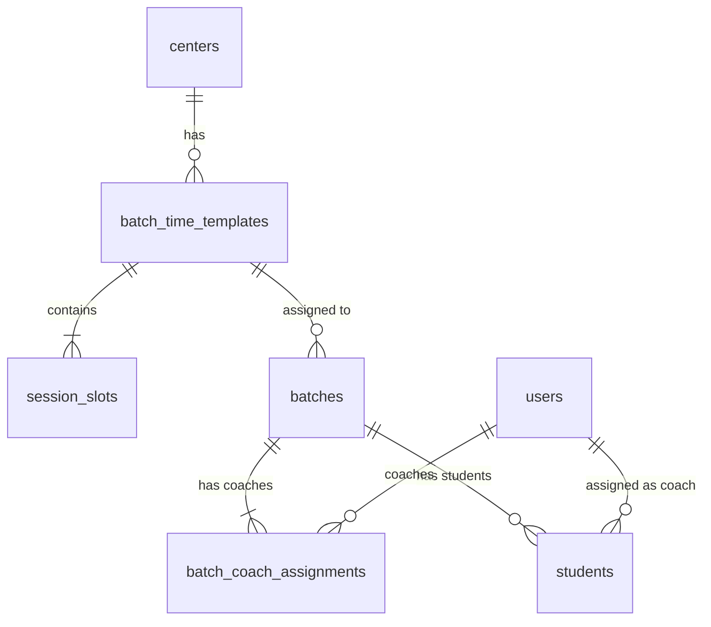

# Design Document: Batch Time Templates

## Overview

Batch Time Templates introduces a first-class schedule-template entity that decouples recurring session patterns from individual batch records. Instead of batches storing inline `days_of_week`, `start_time`, and `end_time` fields, a reusable `batch_time_templates` entity defines a weekly pattern of session slots. Templates are assigned to batches via a foreign key, and the session calendar is generated dynamically from the template's slots.

The batch coaching structure is also extended: each batch requires exactly one head coach, supports optional assistant coaches, and maintains non-overlapping student-to-coach assignments tracked in a dedicated junction table.

### Key Design Decisions

1. **Templates are center-scoped reusable entities** — multiple batches can share the same template, reducing duplication for centers with identical schedules.
2. **Session calendar is generated on-the-fly** — no materialized session rows. The calendar API computes sessions from template slots + date range, keeping the schema simple and avoiding stale data.
3. **Soft-delete with in-use protection** — templates cannot be archived while assigned to active batches, preventing accidental schedule loss.
4. **Coach assignments in a junction table** — `batch_coach_assignments` supports the head/assistant coach model with clear role semantics, replacing the single `assigned_coach_id` column.
5. **Student assignment stored on existing student-batch relationship** — uses an `assigned_coach_id` column on the students table (or a junction table) to track per-student coach responsibility.

## Architecture

```mermaid
graph TD
    subgraph Frontend["React SPA"]
        MDP[MasterDataPage]
        TT[TemplatesTab]
        BT[BatchesTab - Enhanced]
        MDP --> TT
        MDP --> BT
    end

    subgraph API["Express API"]
        TR[/api/batch-time-templates]
        BR[/api/batches - Enhanced]
        BCA[/api/batches/:id/coaches]
        BSA[/api/batches/:id/students/assign]
        SC[/api/session-calendar - Enhanced]
    end

    subgraph Database["PostgreSQL"]
        BTT[batch_time_templates]
        SS[session_slots]
        B[batches]
        BCAS[batch_coach_assignments]
        S[students]
    end

    TT -->|CRUD| TR
    BT -->|assign template| BR
    BT -->|manage coaches| BCA
    BT -->|assign students| BSA

    TR --> BTT
    TR --> SS
    BR --> B
    BCA --> BCAS
    BSA --> S
    SC --> BTT
    SC --> SS

    BTT -- "1:N" --> SS
    B -- "N:1" --> BTT
    BCAS -- "N:1" --> B
    S -- "assigned_coach_id" --> BCAS
```

### Request Flow

1. **Template CRUD**: `TemplatesTab` → `POST/GET/PATCH/DELETE /api/batch-time-templates` → `batch_time_templates` + `session_slots` tables
2. **Template Assignment**: `BatchesTab` → `PATCH /api/batches/:id` (with `template_id`) → `batches.template_id` FK
3. **Coach Management**: `BatchesTab` → `POST/DELETE /api/batches/:id/coaches` → `batch_coach_assignments` table
4. **Student Assignment**: `BatchesTab` → `POST /api/batches/:id/students/assign` → `students.assigned_coach_id` or junction table
5. **Calendar Generation**: `SessionCalendar` → `GET /api/session-calendar` → reads `batch_time_templates` + `session_slots` → computes entries for date range

## Components and Interfaces

### Backend Components

#### 1. Template Controller (`src/controllers/batchTimeTemplates.ts`)

```typescript
// POST /api/batch-time-templates
export const createTemplate = async (req: TenantRequest, res: Response): Promise<void>;
// GET /api/batch-time-templates
export const listTemplates = async (req: TenantRequest, res: Response): Promise<void>;
// GET /api/batch-time-templates/:id
export const getTemplate = async (req: TenantRequest, res: Response): Promise<void>;
// PATCH /api/batch-time-templates/:id
export const updateTemplate = async (req: TenantRequest, res: Response): Promise<void>;
// DELETE /api/batch-time-templates/:id
export const archiveTemplate = async (req: TenantRequest, res: Response): Promise<void>;
```

#### 2. Batch Coach Assignments Controller (`src/controllers/batchCoachAssignments.ts`)

```typescript
// GET /api/batches/:batchId/coaches
export const listBatchCoaches = async (req: TenantRequest, res: Response): Promise<void>;
// POST /api/batches/:batchId/coaches
export const assignCoach = async (req: TenantRequest, res: Response): Promise<void>;
// DELETE /api/batches/:batchId/coaches/:coachId
export const removeCoach = async (req: TenantRequest, res: Response): Promise<void>;
```

#### 3. Student Assignment Controller (`src/controllers/studentAssignments.ts`)

```typescript
// POST /api/batches/:batchId/students/assign
export const assignStudentToCoach = async (req: TenantRequest, res: Response): Promise<void>;
// POST /api/batches/:batchId/students/move
export const moveStudent = async (req: TenantRequest, res: Response): Promise<void>;
// GET /api/batches/:batchId/students/assignments
export const listStudentAssignments = async (req: TenantRequest, res: Response): Promise<void>;
```

#### 4. Validation Schemas (`src/validators/batchTimeTemplate.schemas.ts`)

```typescript
import { z } from 'zod';

const dayOfWeek = z.enum(['Mon', 'Tue', 'Wed', 'Thu', 'Fri', 'Sat', 'Sun']);
const timeFormat = z.string().regex(/^([01]\d|2[0-3]):[0-5]\d$/, 'Must be HH:MM 24-hour format');

const sessionSlotSchema = z.object({
  day_of_week: dayOfWeek,
  start_time: timeFormat,
  duration_hours: z.number().int().min(1).max(4),
});

export const createTemplateSchema = z.object({
  name: z.string().min(1).max(100),
  slots: z.array(sessionSlotSchema).min(1).max(14),
});

export const updateTemplateSchema = z.object({
  name: z.string().min(1).max(100).optional(),
  slots: z.array(sessionSlotSchema).min(1).max(14).optional(),
});
```

#### 5. Routes (`src/routes/batchTimeTemplates.ts`)

```typescript
const router = Router();
router.use(authenticate);
router.use(centerActive);
router.use(tenantScope);

router.get('/', authorize(UserRole.HEAD_COACH, UserRole.ASSISTANT_COACH), listTemplates);
router.get('/:id', authorize(UserRole.HEAD_COACH, UserRole.ASSISTANT_COACH), getTemplate);
router.post('/', authorize(UserRole.HEAD_COACH), validateRequest(createTemplateSchema), createTemplate);
router.patch('/:id', authorize(UserRole.HEAD_COACH), validateRequest(updateTemplateSchema), updateTemplate);
router.delete('/:id', authorize(UserRole.HEAD_COACH), archiveTemplate);
```

#### 6. Session Slot Overlap Validator (pure function)

```typescript
/**
 * Validates that no two session slots overlap on the same day.
 * Two slots overlap if their time ranges intersect:
 *   slot A [startA, startA + durationA) and slot B [startB, startB + durationB)
 * overlap when startA < endB AND startB < endA.
 */
export function validateNoOverlap(slots: SessionSlot[]): { valid: boolean; conflicts: [number, number][] };
```

### Frontend Components

#### 1. TemplatesTab (`src/components/TemplatesTab.tsx`)

New tab component for the MasterDataPage. Displays a list of templates with summary info (name, slot count, day summary). Provides create/edit/delete modals.

**Props:** `{ readOnly: boolean }`

#### 2. TemplateFormModal (`src/components/TemplateFormModal.tsx`)

Modal form for creating/editing templates. Contains:
- Name input
- Session slot list with add/remove buttons
- Each slot: day picker, time input, duration select
- Real-time overlap validation with visual error indicators

#### 3. BatchesTab (Enhanced)

Extended to show:
- Template assignment dropdown
- Head coach / assistant coaches section
- Student-to-coach assignment UI (expandable per coach)

#### 4. CoachAssignmentPanel (`src/components/CoachAssignmentPanel.tsx`)

Sub-component within BatchesTab showing coach structure per batch:
- Head coach (required, single)
- Assistant coaches (optional, with student counts)
- Student assignment/move actions

### API Endpoints Summary

| Method | Path | Role | Description |
|--------|------|------|-------------|
| GET | `/api/batch-time-templates` | HC, AC | List templates for center |
| GET | `/api/batch-time-templates/:id` | HC, AC | Get template with slots |
| POST | `/api/batch-time-templates` | HC | Create template |
| PATCH | `/api/batch-time-templates/:id` | HC | Update template |
| DELETE | `/api/batch-time-templates/:id` | HC | Archive template |
| GET | `/api/batches/:id/coaches` | HC, AC | List batch coach assignments |
| POST | `/api/batches/:id/coaches` | HC | Assign coach to batch |
| DELETE | `/api/batches/:id/coaches/:coachId` | HC | Remove coach from batch |
| POST | `/api/batches/:id/students/assign` | HC | Assign student to coach |
| POST | `/api/batches/:id/students/move` | HC | Move student between coaches |
| GET | `/api/batches/:id/students/assignments` | HC, AC | List student-coach assignments |

## Data Models

### New Tables

#### `batch_time_templates`

| Column | Type | Constraints | Description |
|--------|------|-------------|-------------|
| id | UUID | PK, DEFAULT gen_random_uuid() | Template identifier |
| name | VARCHAR(100) | NOT NULL | Template display name |
| center_id | UUID | NOT NULL, FK → centers(id) | Owning center (tenant scoping) |
| is_archived | BOOLEAN | NOT NULL, DEFAULT false | Soft-delete flag |
| created_at | TIMESTAMP | NOT NULL, DEFAULT NOW() | Creation timestamp |
| updated_at | TIMESTAMP | NOT NULL, DEFAULT NOW() | Last modification timestamp |

**Indexes:**
- `idx_btt_center_id` on `(center_id)`
- `idx_btt_center_active` on `(center_id, is_archived)` — for listing active templates

#### `session_slots`

| Column | Type | Constraints | Description |
|--------|------|-------------|-------------|
| id | UUID | PK, DEFAULT gen_random_uuid() | Slot identifier |
| template_id | UUID | NOT NULL, FK → batch_time_templates(id) ON DELETE CASCADE | Parent template |
| day_of_week | VARCHAR(3) | NOT NULL, CHECK IN ('Mon','Tue','Wed','Thu','Fri','Sat','Sun') | Day of the week |
| start_time | TIME | NOT NULL | Session start time (HH:MM) |
| duration_hours | INTEGER | NOT NULL, CHECK (duration_hours BETWEEN 1 AND 4) | Duration in whole hours |

**Indexes:**
- `idx_ss_template_id` on `(template_id)`

#### `batch_coach_assignments`

| Column | Type | Constraints | Description |
|--------|------|-------------|-------------|
| id | UUID | PK, DEFAULT gen_random_uuid() | Assignment identifier |
| batch_id | UUID | NOT NULL, FK → batches(id) ON DELETE CASCADE | Batch |
| coach_id | UUID | NOT NULL, FK → users(id) | Coach user |
| role | VARCHAR(20) | NOT NULL, CHECK IN ('head_coach','assistant_coach') | Coach role in batch |
| created_at | TIMESTAMP | NOT NULL, DEFAULT NOW() | Assignment timestamp |

**Constraints:**
- UNIQUE `(batch_id, coach_id)` — a coach can only be assigned once per batch
- UNIQUE `(batch_id)` WHERE `role = 'head_coach'` — partial unique index enforcing one head coach per batch

**Indexes:**
- `idx_bca_batch_id` on `(batch_id)`
- `idx_bca_coach_id` on `(coach_id)`

### Modified Tables

#### `batches` — Add column

| Column | Type | Constraints | Description |
|--------|------|-------------|-------------|
| template_id | UUID | NULLABLE, FK → batch_time_templates(id) | Assigned schedule template |

The existing `days_of_week`, `start_time`, `end_time`, `schedule`, and `assigned_coach_id` columns remain for backward compatibility during migration but are deprecated.

#### `students` — Add column (or use junction table)

| Column | Type | Constraints | Description |
|--------|------|-------------|-------------|
| assigned_coach_id | UUID | NULLABLE, FK → users(id) | Coach responsible for this student within their batch |

Students without an explicit `assigned_coach_id` default to the batch's head coach.

### Migration SQL

```sql
-- Migration: 0XX_batch_time_templates.sql
BEGIN;

-- 1. batch_time_templates table
CREATE TABLE IF NOT EXISTS batch_time_templates (
  id UUID PRIMARY KEY DEFAULT gen_random_uuid(),
  name VARCHAR(100) NOT NULL,
  center_id UUID NOT NULL REFERENCES centers(id) ON DELETE CASCADE,
  is_archived BOOLEAN NOT NULL DEFAULT false,
  created_at TIMESTAMP NOT NULL DEFAULT NOW(),
  updated_at TIMESTAMP NOT NULL DEFAULT NOW()
);

CREATE INDEX IF NOT EXISTS idx_btt_center_id ON batch_time_templates(center_id);
CREATE INDEX IF NOT EXISTS idx_btt_center_active ON batch_time_templates(center_id, is_archived);

-- 2. session_slots table
CREATE TABLE IF NOT EXISTS session_slots (
  id UUID PRIMARY KEY DEFAULT gen_random_uuid(),
  template_id UUID NOT NULL REFERENCES batch_time_templates(id) ON DELETE CASCADE,
  day_of_week VARCHAR(3) NOT NULL CHECK (day_of_week IN ('Mon','Tue','Wed','Thu','Fri','Sat','Sun')),
  start_time TIME NOT NULL,
  duration_hours INTEGER NOT NULL CHECK (duration_hours BETWEEN 1 AND 4)
);

CREATE INDEX IF NOT EXISTS idx_ss_template_id ON session_slots(template_id);

-- 3. batch_coach_assignments table
CREATE TABLE IF NOT EXISTS batch_coach_assignments (
  id UUID PRIMARY KEY DEFAULT gen_random_uuid(),
  batch_id UUID NOT NULL REFERENCES batches(id) ON DELETE CASCADE,
  coach_id UUID NOT NULL REFERENCES users(id),
  role VARCHAR(20) NOT NULL CHECK (role IN ('head_coach', 'assistant_coach')),
  created_at TIMESTAMP NOT NULL DEFAULT NOW(),
  CONSTRAINT bca_unique_coach_per_batch UNIQUE (batch_id, coach_id)
);

-- Partial unique index: only one head_coach per batch
CREATE UNIQUE INDEX IF NOT EXISTS idx_bca_one_head_per_batch
  ON batch_coach_assignments(batch_id) WHERE role = 'head_coach';

CREATE INDEX IF NOT EXISTS idx_bca_batch_id ON batch_coach_assignments(batch_id);
CREATE INDEX IF NOT EXISTS idx_bca_coach_id ON batch_coach_assignments(coach_id);

-- 4. Add template_id to batches
ALTER TABLE batches ADD COLUMN IF NOT EXISTS template_id UUID REFERENCES batch_time_templates(id);

-- 5. Add assigned_coach_id to students (for per-student coach assignment within batch)
ALTER TABLE students ADD COLUMN IF NOT EXISTS assigned_coach_id UUID REFERENCES users(id);

COMMIT;
```

### Entity Relationships



## Correctness Properties

*A property is a characteristic or behavior that should hold true across all valid executions of a system — essentially, a formal statement about what the system should do. Properties serve as the bridge between human-readable specifications and machine-verifiable correctness guarantees.*

### Property 1: Template CRUD Round-Trip

*For any* valid template name and set of session slots, creating a template and then reading it back SHALL return the same name and equivalent set of session slots (id-independent equality).

**Validates: Requirements 1.2, 1.3**

### Property 2: Archived Templates Exclusion

*For any* template that has been archived, querying the active templates list for the same center SHALL NOT include that template in the results.

**Validates: Requirements 1.4**

### Property 3: In-Use Template Deletion Prevention

*For any* template that is assigned to at least one non-archived batch, attempting to archive the template SHALL fail with an error, and the template SHALL remain active.

**Validates: Requirements 1.5**

### Property 4: Session Slot Overlap Detection

*For any* two session slots within the same template that share the same day_of_week, if `startA < startB + durationB` AND `startB < startA + durationA` (time ranges overlap), the system SHALL reject the template creation/update.

**Validates: Requirements 2.5**

### Property 5: Template Assignment Invariant

*For any* batch, at most one template_id can be stored. Assigning template B to a batch that already has template A SHALL result in the batch's template_id being B (last-write-wins), not both.

**Validates: Requirements 3.1, 3.2**

### Property 6: Calendar Generation Correctness

*For any* template with N session slots and a date range [start, end], the generated session count for a given slot with day_of_week D SHALL equal the number of occurrences of weekday D within [start, end], and each generated session SHALL have the same start_time and duration_hours as its source slot.

**Validates: Requirements 3.3, 8.1, 8.2, 8.3**

### Property 7: Head Coach Uniqueness Invariant

*For any* batch in the system, the `batch_coach_assignments` table SHALL contain exactly one row with `role = 'head_coach'` for that batch. No operations shall leave a batch with zero or more than one head coach.

**Validates: Requirements 4.1**

### Property 8: Student-Coach Assignment Uniqueness

*For any* batch, each student SHALL be assigned to at most one coach (head_coach or assistant_coach). After any assignment or move operation, no student SHALL appear under multiple coaches within the same batch.

**Validates: Requirements 4.4, 5.1, 5.3**

### Property 9: Coach Removal Triggers Student Reassignment

*For any* batch with an assistant coach who has N assigned students, removing that assistant coach SHALL result in all N students being reassigned to the batch's head coach. The total student count for the batch SHALL remain unchanged.

**Validates: Requirements 4.5, 5.2**

### Property 10: Student Removal Cascades Coach Assignment

*For any* student removed from a batch, that student's `assigned_coach_id` for that batch SHALL also be cleared. The student SHALL not appear in any coach's assignment list for that batch after removal.

**Validates: Requirements 5.5**

## Error Handling

### Backend Error Responses

| Scenario | HTTP Status | Error Response |
|----------|-------------|----------------|
| Invalid template data (Zod validation) | 400 | `{ errors: [{ field, message }] }` |
| Overlapping session slots | 400 | `{ error: "Session slots overlap: [slot details]" }` |
| Template not found | 404 | `{ error: "Template not found" }` |
| Template in use (delete attempt) | 409 | `{ error: "Cannot delete template. Used by batches: [names]" }` |
| Batch not found | 404 | `{ error: "Batch not found" }` |
| Student already assigned to another coach | 409 | `{ error: "Student already assigned to coach [name]" }` |
| No head coach assigned | 400 | `{ error: "Batch must have exactly one head coach" }` |
| Assistant coach without students | 400 | `{ error: "Assistant coach must have at least one student assigned" }` |
| Unauthorized role | 403 | `{ error: "Forbidden" }` |
| Tenant scope violation | 404 | `{ error: "Template not found" }` (silent tenant scoping) |

### Frontend Error Handling

- **Optimistic updates**: Not used. All mutations wait for server confirmation before updating UI state.
- **Form validation**: Client-side Zod validation mirrors server schemas. Overlap check runs in the browser before submission.
- **Toast/banner messages**: Success messages auto-dismiss after 3s. Error messages persist until dismissed or corrected.
- **Network errors**: Generic "Failed to load. Please try again." with retry button, matching existing patterns in `BatchesTab`.
- **Conflict errors (409)**: Display the server-provided error message directly to the user (e.g., which batches use the template).

### Overlap Validation Strategy

The overlap check is implemented as a **pure function** (`validateNoOverlap`) shared between:
1. **Frontend** — runs on every slot change for immediate feedback
2. **Backend** — runs in the controller before database write for authoritative validation

This avoids race conditions where two simultaneous requests could both pass frontend validation but create conflicting slots.

## Testing Strategy

### Property-Based Tests (Vitest + fast-check)

Property-based testing is appropriate for this feature because:
- The session slot overlap detection is a pure function with a large input space (day × time × duration combinations)
- Calendar generation is a pure computation mapping slots + date range → session list
- Coach/student assignment invariants are algebraic properties that must hold across all operation sequences

**Library:** `fast-check` (already compatible with Vitest)
**Iterations:** Minimum 100 per property

Each property test is tagged with:
```
// Feature: batch-time-templates, Property N: [property text]
```

**Property tests to implement:**
1. Template CRUD round-trip (Property 1)
2. Overlap detection — overlapping slots rejected, non-overlapping accepted (Property 4)
3. Calendar generation — session count equals weekday occurrences (Property 6)
4. Calendar generation — session fields match source slot (Property 6)
5. Student uniqueness — no double assignments after any operation (Property 8)

### Unit Tests (Vitest)

- Template creation with valid/invalid data
- Template update with slot changes
- Archive prevention when template is in use
- Coach assignment role validation
- Student assignment conflict detection
- Calendar generation edge cases (empty range, single day, month boundaries)
- Validation schema edge cases (time boundaries 00:00, 23:59; duration limits)

### Integration Tests

- Full CRUD lifecycle through API routes
- Tenant scoping isolation (center A cannot see center B's templates)
- Authorization checks (ASSISTANT_COACH cannot create/delete)
- Foreign key cascade behavior (delete template → cascade slots)
- Partial unique index enforcement (one head coach per batch)

### Frontend Component Tests (Vitest + Testing Library)

- TemplatesTab renders template list
- TemplateFormModal validates overlapping slots visually
- BatchesTab shows template assignment dropdown
- CoachAssignmentPanel displays correct student counts
- Read-only mode hides mutation buttons for ASSISTANT_COACH
