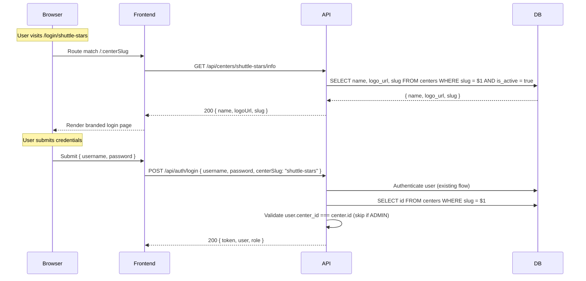

# Design Document: Center Branded Login

## Overview

This feature adds center-branded login pages to ShuttleCoach, allowing each coaching center to have a dedicated URL (`/login/:centerSlug`) displaying the center's name and logo. The system introduces a `slug` column on the `centers` table, a public API to fetch center display info, center-scoped login validation, and a HEAD_COACH settings interface for slug management.

**Key design decisions:**
- Slug is stored at the database level with a UNIQUE constraint, not computed at runtime
- Public center info endpoint requires no authentication (needed before login)
- Center-scoped validation is opt-in via the `centerSlug` request body param — preserves backward compatibility
- ADMIN users bypass center-scoped checks (they aren't bound to a single center)

## Architecture



### Layer Responsibilities

| Layer | Responsibility |
|-------|---------------|
| Database | Store slug with UNIQUE + CHECK constraints; auto-generation via trigger or application code |
| API — Public Route | `GET /api/centers/:slug/info` — no auth, returns display fields only |
| API — Auth Controller | Accept optional `centerSlug`, validate user belongs to center |
| API — Admin Controller | PATCH endpoint accepts `slug` field with validation |
| Frontend — LoginPage | Accept `:centerSlug` route param, fetch center info, render branded UI |
| Frontend — Settings | Slug editor for HEAD_COACH role |

## Components and Interfaces

### Backend Components

#### 1. Slug Utility (`src/utils/slug.ts`)

```typescript
/**
 * Generate a URL-safe slug from a center name.
 * Rules: lowercase, replace spaces/special chars with hyphens, collapse multiple hyphens, trim hyphens from edges.
 */
export function generateSlug(name: string): string;

/**
 * Validate a slug string.
 * Rules: 3-50 chars, only lowercase letters, numbers, and hyphens. Cannot start/end with hyphen.
 */
export function validateSlug(slug: string): { valid: boolean; error?: string };
```

#### 2. Public Centers Controller (`src/controllers/public/centers.ts`)

```typescript
/**
 * GET /api/centers/:slug/info
 * Public endpoint — no auth required.
 * Returns: { name: string, logoUrl: string | null, slug: string }
 * Errors: 404 if slug not found or center inactive
 */
export const getCenterInfo: RequestHandler;
```

#### 3. Modified Auth Controller (`src/controllers/auth.ts`)

Extended `login` function accepts optional `centerSlug` in request body:
- If `centerSlug` is provided and user is not ADMIN: resolve slug → center_id, compare with user's center_id
- If mismatch: return 403 "You do not belong to this center"
- If ADMIN: skip center validation entirely

#### 4. Modified Admin Centers Controller (`src/controllers/admin/centers.ts`)

Extended `updateCenter` to accept `slug` in `allowedFields` with validation:
- Validate format via `validateSlug()`
- Check uniqueness against other centers
- Return 409 "This slug is already taken" on conflict

### Frontend Components

#### 5. LoginPage Enhancement (`src/pages/LoginPage.tsx`)

Add `centerSlug` route param support:
- New state: `centerInfo: { name: string; logoUrl: string | null; slug: string } | null`
- New state: `centerError: boolean` (slug not found)
- New state: `centerLoading: boolean`
- On mount with slug param: fetch `GET /api/centers/:slug/info`
- Render branded header (center name + logo) when `centerInfo` is populated
- Render error state when `centerError` is true
- Include `centerSlug` in login request body when present

#### 6. API Service Extension (`src/services/api.ts`)

```typescript
export const getCenterPublicInfo = (slug: string): Promise<CenterPublicInfo> =>
  fetch(`${API_BASE}/api/centers/${slug}/info`).then(handleResponse);
```

### Route Changes

**API (`src/routes/index.ts`):**
```
GET  /api/centers/:slug/info   → public (no auth middleware)
```

**Frontend (`App.tsx`):**
```
<Route path="/login/:centerSlug" element={<LoginPage />} />
```

## Data Models

### Database Migration

```sql
-- Add slug column to centers table
ALTER TABLE centers ADD COLUMN slug VARCHAR(100);

-- Backfill existing centers with generated slugs
UPDATE centers SET slug = LOWER(REGEXP_REPLACE(REGEXP_REPLACE(name, '[^a-zA-Z0-9\s-]', '', 'g'), '\s+', '-', 'g'));

-- Handle potential duplicates from backfill (append numeric suffix)
-- (handled via application-level migration script)

-- Add constraints after backfill
ALTER TABLE centers ALTER COLUMN slug SET NOT NULL;
ALTER TABLE centers ADD CONSTRAINT centers_slug_unique UNIQUE (slug);
ALTER TABLE centers ADD CONSTRAINT centers_slug_format CHECK (slug ~ '^[a-z0-9]([a-z0-9-]*[a-z0-9])?$');
```

### TypeScript Types

**API (`src/types/index.ts`):**
```typescript
export interface CenterPublicInfo {
  name: string;
  logoUrl: string | null;
  slug: string;
}

// Extend LoginRequest
export interface LoginRequest {
  username: string;
  password: string;
  centerSlug?: string; // optional, for branded login
}
```

**Frontend (`src/types/index.ts`):**
```typescript
export interface CenterPublicInfo {
  name: string;
  logoUrl: string | null;
  slug: string;
}
```

### Slug Generation Logic

```
Input:  "Shuttle Stars Academy!"
Step 1: lowercase → "shuttle stars academy!"
Step 2: replace non-alphanumeric (except spaces/hyphens) with "" → "shuttle stars academy"
Step 3: replace spaces with hyphens → "shuttle-stars-academy"
Step 4: collapse multiple hyphens → "shuttle-stars-academy"
Step 5: trim leading/trailing hyphens → "shuttle-stars-academy"
Output: "shuttle-stars-academy"
```

### Slug Validation Rules

| Rule | Constraint |
|------|-----------|
| Length | 3–50 characters |
| Allowed chars | `[a-z0-9-]` |
| Start/end | Must start and end with alphanumeric |
| No consecutive hyphens | `--` not allowed |

## Correctness Properties

*A property is a characteristic or behavior that should hold true across all valid executions of a system — essentially, a formal statement about what the system should do. Properties serve as the bridge between human-readable specifications and machine-verifiable correctness guarantees.*

### Property 1: Slug validation correctly classifies inputs

*For any* string, the `validateSlug` function SHALL return `valid: true` if and only if the string is 3–50 characters long, contains only lowercase letters, numbers, and hyphens, starts and ends with an alphanumeric character, and contains no consecutive hyphens.

**Validates: Requirements 1.2, 7.2**

### Property 2: Slug generation always produces a valid slug

*For any* non-empty center name string, `generateSlug(name)` SHALL produce a string that passes `validateSlug()` (returns `valid: true`), provided the name contains at least one alphanumeric character.

**Validates: Requirements 1.3**

### Property 3: Public center info response contains only allowed fields

*For any* center record in the database, the response from `GET /api/centers/:slug/info` SHALL contain exactly the fields `name`, `logoUrl`, and `slug` — no other fields from the center record (such as `id`, `contactEmail`, `headCoachId`, `planType`, etc.) SHALL be present.

**Validates: Requirements 2.4**

### Property 4: Center-scoped login validation correctness

*For any* authenticated user and any center slug, the login center validation SHALL succeed if and only if `user.role === 'ADMIN'` OR `user.center_id` equals the `id` of the center identified by the slug. All other cases SHALL be rejected with 403.

**Validates: Requirements 4.2, 4.3**

### Property 5: Slug management role restriction

*For any* user with a role other than HEAD_COACH or ADMIN, attempting to update a center's slug SHALL be rejected with a 403 status, regardless of the slug value or center.

**Validates: Requirements 7.6**

## Error Handling

| Scenario | HTTP Status | Error Message | Frontend Behavior |
|----------|-------------|---------------|-------------------|
| Slug not found (API) | 404 | "Center not found" | Show error page with link to `/login` |
| Inactive center (API) | 404 | "Center not found" | Same as above (don't reveal center exists) |
| User doesn't belong to center | 403 | "You do not belong to this center" | Show error in login form |
| Slug already taken (update) | 409 | "This slug is already taken" | Show inline field error |
| Invalid slug format (update) | 400 | "Slug must contain only lowercase letters, numbers, and hyphens (3-50 chars)" | Show inline field error |
| Center info API network error | — | — | Show generic error with retry option |
| Empty/invalid slug in URL | — | — | Frontend pre-validates, API returns 404 |

### Security Considerations

- Public endpoint returns **only** display fields — no IDs, emails, or coach references
- Inactive center returns 404 (not 403) to avoid information leakage about center existence
- Slug format constraint prevents path traversal or injection via URL params
- Center-scoped validation happens server-side after successful auth — not bypassable from frontend

## Testing Strategy

### Property-Based Tests (fast-check)

Each property test runs **minimum 100 iterations** with random inputs.

Library: **fast-check** (TypeScript PBT library, already compatible with the project's Vitest/Jest setup)

| Property | Test Description | Tag |
|----------|-----------------|-----|
| 1 | Generate random strings, verify `validateSlug` classification matches regex `^[a-z0-9]([a-z0-9-]*[a-z0-9])?$` with length 3–50 | Feature: center-branded-login, Property 1: Slug validation correctly classifies inputs |
| 2 | Generate random center names (strings with ≥1 alphanumeric char), verify `generateSlug(name)` always passes `validateSlug` | Feature: center-branded-login, Property 2: Slug generation always produces a valid slug |
| 3 | Generate random center objects with extra fields, pass through response shaper, verify only `name`/`logoUrl`/`slug` keys exist | Feature: center-branded-login, Property 3: Public center info response contains only allowed fields |
| 4 | Generate random (user, center) pairs with varying roles and center_ids, verify validation result matches the rule | Feature: center-branded-login, Property 4: Center-scoped login validation correctness |
| 5 | Generate random users with STUDENT/ASSISTANT_COACH roles, verify slug update is always rejected | Feature: center-branded-login, Property 5: Slug management role restriction |

### Unit Tests (example-based)

- `generateSlug("Shuttle Stars Academy!")` → `"shuttle-stars-academy"`
- `generateSlug("  ABC  ")` → `"abc"`
- `validateSlug("ab")` → invalid (too short)
- `validateSlug("a".repeat(51))` → invalid (too long)
- `validateSlug("ABC")` → invalid (uppercase)
- `validateSlug("-abc")` → invalid (starts with hyphen)
- Center info returns 404 for non-existent slug
- Center info returns 404 for inactive center
- Login with valid credentials + matching centerSlug → success
- Login with valid credentials + non-matching centerSlug → 403
- Login with ADMIN + any centerSlug → success
- Login without centerSlug → success (backward compatible)

### Integration Tests

- Full flow: create center → auto-generates slug → fetch public info → branded login
- Slug uniqueness: attempt duplicate slug → 409
- HEAD_COACH updates slug → subsequent login URL works with new slug
