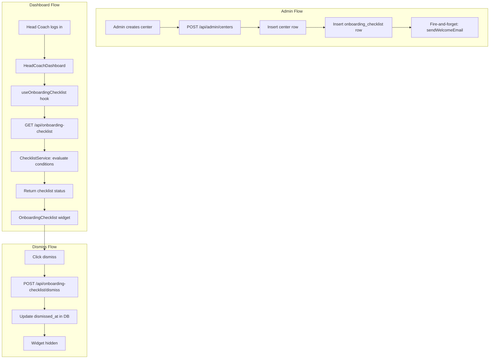

# Design Document: Center Onboarding Checklist

## Overview

This feature adds an onboarding experience for newly created centers in ShuttleCoach. When an admin creates a center and assigns a head coach, the system sends a welcome email with credentials and a setup guide. The head coach's dashboard then displays a persistent checklist widget tracking six key setup tasks. Completion is detected automatically from real data (coaches, students, curriculum, batch templates, batches, assignments). The checklist can be manually dismissed or auto-hides when all items are complete.

The design spans three layers:
- **Database**: A single `center_onboarding_checklists` table storing per-center checklist state
- **API**: Two endpoints — GET for status retrieval (with live completion detection) and POST for dismissal
- **Frontend**: A React widget on the HeadCoachDashboard with a custom hook for data fetching
- **Email**: A welcome email function triggered asynchronously after center creation

## Architecture



### Key Design Decisions

1. **Single row per center with JSONB items**: The `center_onboarding_checklists` table stores one row per center. The six checklist items are stored as a JSONB array column rather than a separate items table. This simplifies queries (single row read/write) and avoids join overhead for what is always a fixed set of six items.

2. **Live completion detection on each GET**: The API evaluates completion conditions from real data on every request rather than relying on cached/stored booleans. The stored `items` JSONB is updated as a side-effect to persist first-completion timestamps, but the source of truth is always the live count queries.

3. **Async welcome email via fire-and-forget**: The welcome email is triggered after the center creation response using `setImmediate` / `process.nextTick` to avoid blocking the creation response. A single retry with 5-second delay handles transient failures.

4. **Frontend graceful degradation**: If the checklist API fails or times out, the widget is hidden silently — it never blocks dashboard rendering.

## Components and Interfaces

### Backend Components

#### 1. Migration: `019_center_onboarding_checklists.sql`

Creates the `center_onboarding_checklists` table.

#### 2. Service: `src/services/onboardingChecklistService.ts`

Pure business logic for evaluating checklist completion:
- `evaluateChecklistItems(centerId: string, headCoachId: string)`: Runs count queries against relevant tables and returns current completion state for all six items.
- `getOrCreateChecklist(centerId: string)`: Retrieves or initializes the checklist row.
- `dismissChecklist(centerId: string)`: Sets the `dismissed_at` timestamp.
- `reconcileItems(stored: ChecklistItem[], live: ChecklistItem[])`: Merges live state with stored timestamps (preserves first-detected timestamps).

#### 3. Controller: `src/controllers/onboardingChecklist.ts`

Handles HTTP requests:
- `getChecklistStatus`: GET handler — authenticates, authorizes HEAD_COACH, evaluates live conditions, returns response.
- `dismissChecklist`: POST handler — authenticates, authorizes HEAD_COACH, marks dismissed.

#### 4. Route: `src/routes/onboardingChecklist.ts`

Registers routes with auth + authorize middleware:
- `GET /api/onboarding-checklist` → `getChecklistStatus`
- `POST /api/onboarding-checklist/dismiss` → `dismissChecklist`

#### 5. Email Function: `src/services/welcomeEmailService.ts`

New function `sendCenterWelcomeEmail` in a separate file (keeps concerns separated from password reset email):
- Accepts center name, head coach email, username, password reset link, center login URL.
- Renders an HTML template with the six onboarding steps listed.
- Uses the existing nodemailer transporter configuration.

#### 6. Center Creation Hook

Modify `src/controllers/admin/centers.ts` `createCenter` to:
1. After successful center INSERT, insert a checklist row.
2. Fire async welcome email (non-blocking).

### Frontend Components

#### 7. Hook: `src/hooks/useOnboardingChecklist.ts`

Custom hook following the existing pattern (useState + useEffect + apiClient):
- Fetches `GET /api/onboarding-checklist` on mount.
- Exposes: `checklist`, `loading`, `error`, `dismiss()`, `dismissing`.
- Returns `null` for checklist if API fails (widget hides gracefully).

#### 8. Widget: `src/components/OnboardingChecklist.tsx`

React component rendering the checklist card:
- Shows progress: "{n} of 6 completed"
- Lists six items with check/uncheck icons and navigation links
- Dismiss button with confirmation
- Placed at top of HeadCoachDashboard content area

#### 9. Dashboard Integration

Modify `HeadCoachDashboard.tsx` to render `<OnboardingChecklist />` above existing content, conditionally based on hook state.

### Interface Contracts

```typescript
// API Response: GET /api/onboarding-checklist
interface OnboardingChecklistResponse {
  items: ChecklistItemResponse[];
  allComplete: boolean;
  dismissedAt: string | null; // ISO timestamp or null
}

interface ChecklistItemResponse {
  key: string;           // e.g., "add_coach"
  label: string;         // e.g., "Add a coach"
  completed: boolean;
  completedAt: string | null; // ISO timestamp
  link: string;          // frontend route path
}

// API Request: POST /api/onboarding-checklist/dismiss
// Body: {} (empty — center scoped via auth token)

// API Response: POST /api/onboarding-checklist/dismiss
interface DismissResponse {
  success: boolean;
  dismissedAt: string; // ISO timestamp
}
```

## Data Models

### Table: `center_onboarding_checklists`

| Column | Type | Constraints | Description |
|--------|------|-------------|-------------|
| id | UUID | PRIMARY KEY, DEFAULT gen_random_uuid() | Row identifier |
| center_id | UUID | NOT NULL, UNIQUE, FK → centers.id ON DELETE CASCADE | One checklist per center |
| items | JSONB | NOT NULL, DEFAULT '[]' | Array of checklist item states |
| dismissed_at | TIMESTAMPTZ | NULL | When the checklist was dismissed |
| created_at | TIMESTAMPTZ | NOT NULL, DEFAULT NOW() | Row creation time |
| updated_at | TIMESTAMPTZ | NOT NULL, DEFAULT NOW() | Last update time |

**Index**: `UNIQUE(center_id)` — enforces one checklist per center.

### JSONB `items` Structure

```json
[
  {
    "key": "add_coach",
    "completed": true,
    "completedAt": "2025-01-15T10:30:00Z"
  },
  {
    "key": "add_students",
    "completed": false,
    "completedAt": null
  },
  {
    "key": "setup_curriculum",
    "completed": false,
    "completedAt": null
  },
  {
    "key": "create_batch_templates",
    "completed": false,
    "completedAt": null
  },
  {
    "key": "create_batches",
    "completed": false,
    "completedAt": null
  },
  {
    "key": "assign_students",
    "completed": false,
    "completedAt": null
  }
]
```

### Checklist Item Keys and Completion Conditions

| Key | Label | SQL Condition |
|-----|-------|---------------|
| `add_coach` | Add a coach | `SELECT COUNT(*) FROM users WHERE center_id = $1 AND role IN ('ASSISTANT_COACH', 'HEAD_COACH') AND id != $2` (where $2 = head_coach_id) |
| `add_students` | Add students | `SELECT COUNT(*) FROM students WHERE center_id = $1` |
| `setup_curriculum` | Set up curriculum | `SELECT COUNT(*) FROM curriculum_plans WHERE center_id = $1` |
| `create_batch_templates` | Create batch templates | `SELECT COUNT(*) FROM batch_time_templates WHERE center_id = $1` |
| `create_batches` | Create batches | `SELECT COUNT(*) FROM batches WHERE center_id = $1` |
| `assign_students` | Assign students to coaches/batches | `SELECT COUNT(*) FROM students WHERE center_id = $1 AND (assigned_coach_id IS NOT NULL OR batch_id IS NOT NULL)` |

### Completion Detection Query (Single Optimized Query)

Rather than six separate queries, use a single query with lateral subqueries:

```sql
SELECT
  (SELECT COUNT(*) FROM users WHERE center_id = $1 AND role IN ('ASSISTANT_COACH', 'HEAD_COACH') AND id != $2) AS coach_count,
  (SELECT COUNT(*) FROM students WHERE center_id = $1) AS student_count,
  (SELECT COUNT(*) FROM curriculum_plans WHERE center_id = $1) AS curriculum_count,
  (SELECT COUNT(*) FROM batch_time_templates WHERE center_id = $1) AS template_count,
  (SELECT COUNT(*) FROM batches WHERE center_id = $1) AS batch_count,
  (SELECT COUNT(*) FROM students WHERE center_id = $1 AND (assigned_coach_id IS NOT NULL OR batch_id IS NOT NULL)) AS assigned_count
```

This executes as a single round-trip to the database and returns all six counts.

### Navigation Links Mapping

| Key | Frontend Route |
|-----|---------------|
| `add_coach` | `/coaches` |
| `add_students` | `/students` |
| `setup_curriculum` | `/curriculum` |
| `create_batch_templates` | `/batches` (batch templates section) |
| `create_batches` | `/batches` |
| `assign_students` | `/students` |


## Correctness Properties

*A property is a characteristic or behavior that should hold true across all valid executions of a system — essentially, a formal statement about what the system should do. Properties serve as the bridge between human-readable specifications and machine-verifiable correctness guarantees.*

### Property 1: Email template contains all required fields

*For any* valid username string, password reset URL, and center login URL, the rendered welcome email HTML SHALL contain the username, the reset URL, and the login URL as substrings.

**Validates: Requirements 1.2**

### Property 2: Invalid email addresses prevent delivery

*For any* email address that is null, empty, consists only of whitespace, or fails basic format validation (no "@" or no domain part), the welcome email function SHALL skip delivery and return without throwing, logging a warning.

**Validates: Requirements 1.4**

### Property 3: Completion detection maps counts to booleans

*For any* non-negative integer count associated with a checklist item, the item SHALL be reported as complete if and only if count >= 1. Specifically, for any set of six non-negative counts (coachCount, studentCount, curriculumCount, templateCount, batchCount, assignedCount), the corresponding item's `completed` flag SHALL equal `count >= 1`.

**Validates: Requirements 6.1, 6.2, 6.3, 6.4, 6.5, 6.6**

### Property 4: Reconciliation preserves first-detection timestamps

*For any* pair of (live completion state, stored completion state with optional timestamp), the reconciliation function SHALL:
- If live=true and stored.completed=false: set completed=true with a new timestamp (first detection)
- If live=true and stored.completed=true: keep completed=true and preserve the existing timestamp
- If live=false and stored.completed=true: set completed=false and clear the timestamp to null
- If live=false and stored.completed=false: keep completed=false with null timestamp

**Validates: Requirements 2.3, 2.4, 2.5, 6.7**

### Property 5: allComplete flag is logical AND of all items

*For any* array of exactly six checklist items with arbitrary completion states, the `allComplete` flag SHALL be true if and only if every item in the array has `completed === true`.

**Validates: Requirements 3.3**

### Property 6: Progress count equals completed item count

*For any* array of exactly six checklist items with arbitrary completion states, the progress count `n` in "{n} of 6 completed" SHALL equal the number of items where `completed === true`.

**Validates: Requirements 5.3**

## Error Handling

### Backend Error Handling

| Scenario | Behavior |
|----------|----------|
| Email address null/empty/invalid | Log warning with center_id, skip email, don't fail center creation |
| SMTP transient failure | Retry once after 5s delay; if retry fails, log error with center_id, continue |
| Database error on checklist GET | Return 500 with generic error message |
| No checklist row exists for center | Return default response with six incomplete items (no error) |
| Unauthenticated request | Return 401 `{ error: "No token provided" }` |
| Non-HEAD_COACH role | Return 403 `{ error: "You do not have permission to perform this action" }` |
| Dismiss fails (DB error) | Return 500 with generic error message |
| Completion count query fails | Return 500; do not return partial data |

### Frontend Error Handling

| Scenario | Behavior |
|----------|----------|
| Checklist API returns error | Hide widget, don't block dashboard |
| Checklist API times out (10s) | Hide widget, don't block dashboard |
| Dismiss API fails | Show inline error toast "Could not dismiss checklist. Please try again.", keep widget visible |
| Network offline | Same as API error — hide widget gracefully |

## Testing Strategy

### Unit Tests (Example-Based)

- Email template renders all six onboarding task labels
- Checklist initialization creates correct default state
- API returns 401 for unauthenticated requests
- API returns 403 for non-HEAD_COACH roles
- API returns default empty state when no checklist row exists
- Widget renders at dashboard top when checklist is active
- Widget hides when dismissed or allComplete
- Dismiss error shows user-facing message
- Navigation links map correctly to routes

### Property-Based Tests

Library: **fast-check** (TypeScript, works with Vitest)

Each property test runs minimum 100 iterations:

- **Feature: center-onboarding-checklist, Property 1: Email template contains all required fields** — Generate random strings for username, resetUrl, loginUrl; verify all appear in rendered HTML.
- **Feature: center-onboarding-checklist, Property 2: Invalid email addresses prevent delivery** — Generate random invalid emails (null, empty, whitespace, malformed); verify no delivery attempt.
- **Feature: center-onboarding-checklist, Property 3: Completion detection maps counts to booleans** — Generate six random non-negative integers; verify each item's completed flag equals (count >= 1).
- **Feature: center-onboarding-checklist, Property 4: Reconciliation preserves first-detection timestamps** — Generate random (live, stored) state pairs; verify reconciliation output matches the four-case specification.
- **Feature: center-onboarding-checklist, Property 5: allComplete flag is logical AND of all items** — Generate random arrays of six booleans; verify allComplete equals every item being true.
- **Feature: center-onboarding-checklist, Property 6: Progress count equals completed item count** — Generate random arrays of six booleans; verify count matches filter(completed).length.

### Integration Tests

- Center creation triggers checklist row insertion
- Center creation fires welcome email asynchronously
- GET endpoint returns live completion state after data changes
- Dismiss endpoint persists dismissed_at and subsequent GET reflects it
- Multi-center user sees correct checklist per active center
