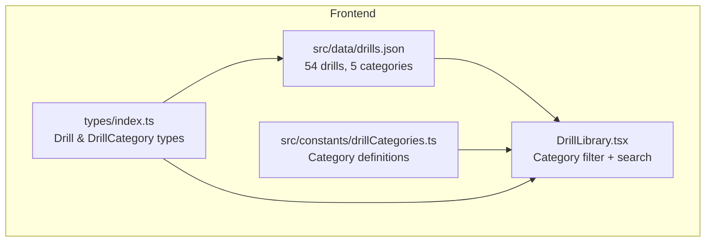
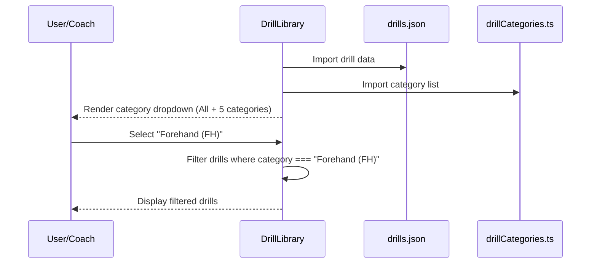

# Design Document: Drill Category Alignment

## Overview

The DrillLibrary currently fetches drills from the API with categories that don't match the coach's actual training taxonomy. This redesign replaces the drill data with a coach-defined list of 54 drills across 5 categories: Service, Service Return, Forehand (FH), Round Head, and Backhand (BH).

The local `src/data/drills.json` file will serve as the source of truth for now, with a structure that supports future API migration. The DrillLibrary component's category dropdown will show these 5 categories. Existing curriculum plans referencing old drill IDs will be treated as legacy (no breakage — unrecognized IDs simply won't match new drills).

## Architecture



## Sequence Diagram: Drill Loading & Filtering



## Components and Interfaces

### Component 1: Drill Categories Constant

**Purpose**: Single source of truth for the 5 drill categories.

```typescript
// src/constants/drillCategories.ts

export type DrillCategory =
  | 'Service'
  | 'Service Return'
  | 'Forehand (FH)'
  | 'Round Head'
  | 'Backhand (BH)';

export const DRILL_CATEGORIES: DrillCategory[] = [
  'Service',
  'Service Return',
  'Forehand (FH)',
  'Round Head',
  'Backhand (BH)',
];

export const DRILL_CATEGORY_LABELS: Record<DrillCategory, string> = {
  'Service': 'Service',
  'Service Return': 'Service Return',
  'Forehand (FH)': 'Forehand (FH)',
  'Round Head': 'Round Head',
  'Backhand (BH)': 'Backhand (BH)',
};
```

### Component 2: Updated Drill Interface

**Purpose**: Drill type with the `category` field restricted to the 5 drill categories.

```typescript
// In src/types/index.ts
export interface Drill {
  id: string;
  name: string;
  description: string;
  category: string; // One of: 'Service' | 'Service Return' | 'Forehand (FH)' | 'Round Head' | 'Backhand (BH)'
}
```

### Component 3: drills.json Data File

**Purpose**: Local drill data with 54 drills across 5 categories. Structure supports future API migration.

```typescript
// src/data/drills.json — structure
interface DrillsData {
  drills: Drill[];
}
```

**Drill List by Category**:

| Category | Drills |
|----------|--------|
| Service (5) | BH Short Service, BH Flick Service, FH Short Service, FH Long Service, FH Flick Service |
| Service Return (6) | Service return STR Keep, Service return Cross Keep, Service return STR Push, Service return Cross Push, Service return STR Lift, Service return Cross Lift |
| Forehand (FH) (19) | Cross Drop FH, Straight Drop FH, Straight Smash FH, Cross Smash FH, Straight Drive FH, Cross Drive FH, Reverse Slice Straight FH, Forward Slice Straight FH, Forward Slice Cross FH, Straight Defence FH, Cross defense FH, Straight Keep FH, Cross Keep FH, Lift Straight FH, Lift Cross FH, Toss Straight FH, Toss Cross FH, Dribble keep I/O FH, Dribble keep I/O FH |
| Round Head (9) | Cross Drop Round head, Straight Drop Round head, Straight Smash Round head, Cross Smash Round head, Straight Drive Round head, Cross Drive Round head, Reverse Slice Straight Round head, Forward Slice Straight Round head, Reverse Slice Cross Round head |
| Backhand (BH) (14) | Straight Defence BH, Cross defense BH, Straight Keep BH, Cross Keep BH, Lift Straight BH, Lift Cross BH, Toss Straight BH, Toss Cross BH, Dribble keep I/O BH, Dribble keep I/O BH, Back hand Straight Toss, Back hand Straight Drop, Back hand Cross Drop, Back hand Cross Toss |

### Component 4: Updated DrillLibrary Component

**Purpose**: Replace dynamic category derivation with static 5-category dropdown. Load drills from local JSON instead of API.

**Key Changes**:
- Import drills from `src/data/drills.json` instead of fetching from API
- Import `DRILL_CATEGORIES` from constants
- Replace `categories` computed from drill data with the fixed category list
- Remove API loading/error states (data is local)
- Keep search and drag-and-drop functionality intact

## Data Models

### Model: Drill Entry (drills.json)

```typescript
{
  id: string;         // Format: "drill-{category-prefix}-{nn}" e.g. "drill-svc-01"
  name: string;       // Exact drill name from coach's list
  description: string; // Brief description of the drill
  category: string;   // One of the 5 categories
}
```

**ID Format**:
- Service: `drill-svc-01` through `drill-svc-05`
- Service Return: `drill-sr-01` through `drill-sr-06`
- Forehand: `drill-fh-01` through `drill-fh-19`
- Round Head: `drill-rh-01` through `drill-rh-09`
- Backhand: `drill-bh-01` through `drill-bh-14`

## Error Handling

### Scenario 1: Legacy Curriculum Plan References

**Condition**: Existing curriculum plans reference old drill IDs (e.g., `drill-001`).
**Response**: The curriculum plan views display whatever drill data is embedded in the JSONB. Since drill objects are stored inline in week plans, they render independently of the drill library.
**Recovery**: Coaches can manually update curriculum plans to use new drills.

### Scenario 2: Future API Migration

**Condition**: When drills move to a database/API.
**Response**: Replace the JSON import with an API fetch call. The data shape is identical — the component only needs to change data source, not rendering logic.
**Recovery**: The `DrillCategory` type and `DRILL_CATEGORIES` constant remain the same.

## Testing Strategy

### Unit Testing Approach

- Test that `drills.json` contains exactly 54 drills (5+6+19+9+14 = 53, with 1 duplicate entry from user list = 54 entries as specified)
- Test that every drill has a valid category from `DRILL_CATEGORIES`
- Test that DrillLibrary renders 6 options in the dropdown (All + 5 categories)
- Test that category filtering returns only drills matching the selected category

## Dependencies

- `src/types/index.ts` — Drill interface (no change needed, category is already `string`)
- `src/constants/drillCategories.ts` — New file with category constants
- `src/data/drills.json` — New file with 54 drills
- `src/components/DrillLibrary.tsx` — Updated to use local data + static categories

## Correctness Properties

*A property is a characteristic or behavior that should hold true across all valid executions of a system — essentially, a formal statement about what the system should do. Properties serve as the bridge between human-readable specifications and machine-verifiable correctness guarantees.*

### Property 1: Category Validity

*For any* drill in drills.json, its `category` value is one of the 5 defined drill categories (Service, Service Return, Forehand (FH), Round Head, Backhand (BH)).

**Validates: Requirements 2.2**

### Property 2: Category Filter Completeness

*For any* category filter value selected in the DrillLibrary, every drill displayed has a `category` field exactly matching the selected filter.

**Validates: Requirements 3.3**

### Property 3: Drill ID Uniqueness

*For any* two drills in drills.json, their `id` values are distinct.

**Validates: Requirements 4.1, 4.3**

### Property 4: Drill Completeness

*For any* drill in drills.json, the drill has a non-empty `id`, `name`, `description`, and `category` field.

**Validates: Requirements 4.2**
