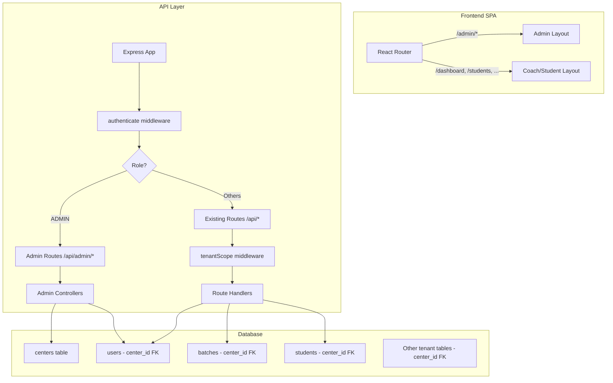
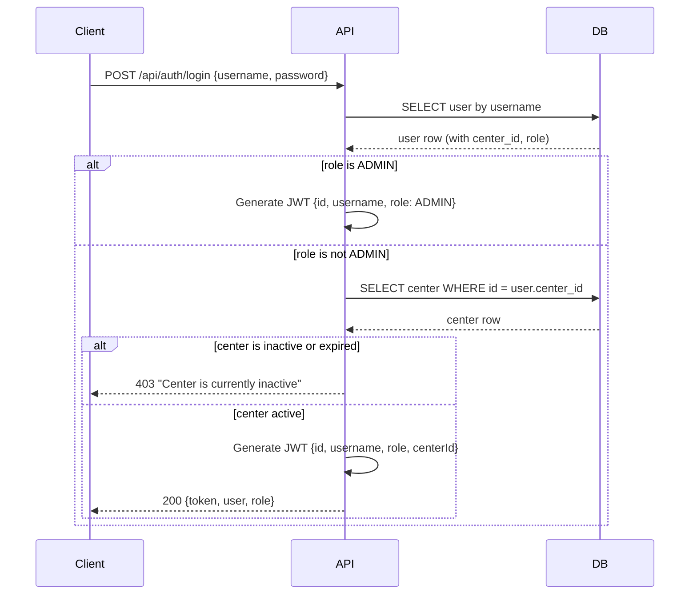
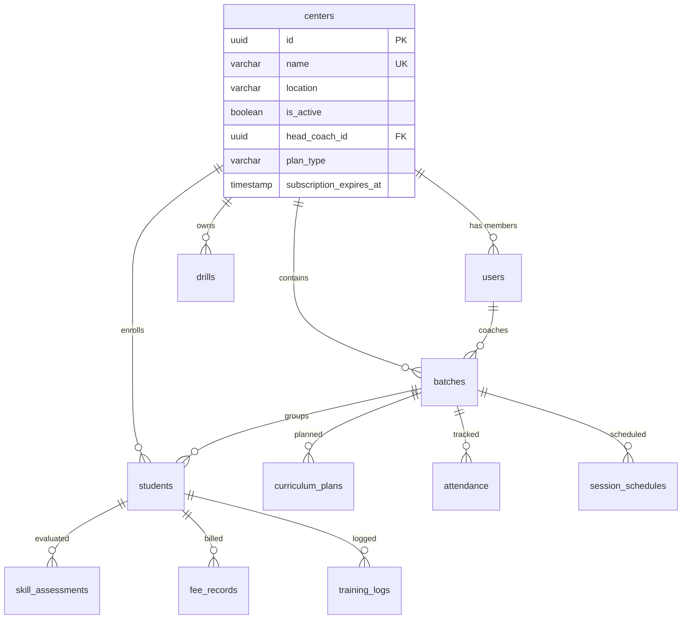

# Design Document: Multi-Center Admin System

## Overview

This design introduces multi-tenancy to the ShuttleCoach platform by adding a `centers` table, an ADMIN role, and center-scoping middleware. The architecture follows an additive strategy: existing routes and controllers remain unchanged, while a new middleware layer transparently injects `center_id` into queries. ADMIN-specific routes live under a separate `/api/admin/*` prefix with dedicated controllers.

### Key Design Decisions

1. **Scoping middleware over query rewriting** — A middleware attaches `center_id` to `req` context; controllers read it from there. This avoids rewriting every existing query and keeps changes minimal.
2. **Additive ADMIN routes** — New `/api/admin/*` endpoints serve admin-only operations (center CRUD, dashboard aggregates). Existing `/api/*` routes remain untouched for HEAD_COACH/ASSISTANT_COACH/STUDENT.
3. **JWT extension** — The token payload gains an optional `centerId` field. ADMIN tokens omit it; all other roles include it.
4. **Single migration transaction** — All schema changes and data backfill run in one transaction for atomicity.

---

## Architecture



### Request Flow

1. Client sends request with `Authorization: Bearer <token>`
2. `authenticate` middleware verifies JWT, extracts `{ id, username, role, centerId? }`
3. For `/api/admin/*` routes: `authorize('ADMIN')` gates access, no tenant scoping needed
4. For `/api/*` routes: `tenantScope` middleware reads `centerId` from token and attaches it to `req.tenantCenterId`
5. Controllers use `req.tenantCenterId` in WHERE clauses (or omit it for ADMIN with explicit `?center_id=` param)

---

## Components and Interfaces

### Backend Components

#### 1. Extended Auth Types

```typescript
// src/types/index.ts additions
export enum UserRole {
  ADMIN = 'ADMIN',
  HEAD_COACH = 'HEAD_COACH',
  ASSISTANT_COACH = 'ASSISTANT_COACH',
  STUDENT = 'STUDENT',
}

export interface Center {
  id: string;
  name: string;
  location: string;
  contactPhone?: string;
  contactEmail?: string;
  logoUrl?: string;
  isActive: boolean;
  headCoachId?: string;
  planType?: string;
  subscriptionExpiresAt?: Date;
  createdAt: Date;
  updatedAt: Date;
}
```

#### 2. JWT Payload Extension

```typescript
// src/utils/auth.ts — updated payload
export interface JwtPayload {
  id: string;
  username: string;
  role: UserRole;
  centerId?: string; // Present for non-ADMIN roles, absent for ADMIN
}
```

#### 3. Tenant Scoping Middleware

```typescript
// src/middleware/tenantScope.ts
import { Response, NextFunction } from 'express';
import { AuthRequest } from './auth';
import { UserRole } from '../types';

export interface TenantRequest extends AuthRequest {
  tenantCenterId?: string; // null means unscoped (ADMIN)
}

export const tenantScope = (
  req: TenantRequest,
  res: Response,
  next: NextFunction
): void => {
  if (!req.user) {
    res.status(401).json({ error: 'Authentication required' });
    return;
  }

  if (req.user.role === UserRole.ADMIN) {
    // ADMIN may optionally scope to a specific center via query param
    const queryCenterId = req.query.center_id as string | undefined;
    req.tenantCenterId = queryCenterId || undefined;
  } else {
    // Non-ADMIN: centerId comes from JWT
    const centerId = (req.user as any).centerId;
    if (!centerId) {
      res.status(403).json({ error: 'User not associated with a center' });
      return;
    }
    req.tenantCenterId = centerId;
  }

  next();
};
```

#### 4. Center Active Check Middleware

```typescript
// src/middleware/centerActive.ts
// Runs after authenticate, before route handlers for non-ADMIN users
// Verifies the user's center is active and subscription is valid
export const centerActiveCheck = async (
  req: TenantRequest,
  res: Response,
  next: NextFunction
): Promise<void> => {
  if (req.user?.role === UserRole.ADMIN) {
    return next();
  }
  
  const centerId = (req.user as any).centerId;
  // Query centers table for is_active and subscription_expires_at
  // Reject with 403 "Center is currently inactive" if not active
};
```

#### 5. Admin Routes

| Method | Path | Description |
|--------|------|-------------|
| GET | `/api/admin/dashboard` | Aggregate stats across all centers |
| GET | `/api/admin/centers` | List all centers |
| POST | `/api/admin/centers` | Create a new center |
| PATCH | `/api/admin/centers/:id` | Update center attributes |
| POST | `/api/admin/centers/:id/assign-coach` | Assign HEAD_COACH to center |
| POST | `/api/admin/centers/:id/activate` | Activate/deactivate center |
| GET | `/api/admin/centers/:id/stats` | Per-center statistics |

#### 6. Updated Route Registration

```typescript
// src/routes/index.ts — addition
import adminRoutes from './admin';

// Admin routes (ADMIN role only)
router.use('/admin', authenticate, authorize(UserRole.ADMIN), adminRoutes);

// Existing routes now have tenantScope injected
router.use('/students', authenticate, tenantScope, studentRoutes);
router.use('/batches', authenticate, tenantScope, batchRoutes);
// ... etc
```

### Frontend Components

#### 1. Admin Layout Component

```typescript
// src/layouts/AdminLayout.tsx
// Renders sidebar nav: Dashboard, Centers, Settings
// Wraps all /admin/* routes
```

#### 2. New Pages

| Route | Component | Description |
|-------|-----------|-------------|
| `/admin/dashboard` | `AdminDashboardPage` | Aggregate stats, center cards |
| `/admin/centers` | `CentersListPage` | List all centers with status |
| `/admin/centers/:id` | `CenterDetailPage` | Center detail + stats |
| `/admin/centers/new` | `CreateCenterPage` | Create center form |

#### 3. Updated AuthContext

```typescript
// Token decode now includes centerId
export interface AuthContext {
  user: User | null;
  role: UserRole | null;
  centerId: string | null; // null for ADMIN
  token: string | null;
  isAuthenticated: boolean;
  login: (username: string, password: string) => Promise<void>;
  logout: () => void;
}
```

#### 4. ProtectedRoute Enhancement

The existing `ProtectedRoute` component already accepts `allowedRoles`. Admin routes use `allowedRoles={['ADMIN']}`. No structural change needed — just add `'ADMIN'` to the `UserRole` type on the frontend.

---

## Data Models

### New Table: `centers`

```sql
CREATE TABLE centers (
  id UUID PRIMARY KEY DEFAULT gen_random_uuid(),
  name VARCHAR(100) NOT NULL UNIQUE,
  location VARCHAR(200),
  contact_phone VARCHAR(20),
  contact_email VARCHAR(100),
  logo_url TEXT,
  is_active BOOLEAN NOT NULL DEFAULT true,
  head_coach_id UUID REFERENCES users(id) ON DELETE SET NULL,
  plan_type VARCHAR(50) DEFAULT 'basic',
  subscription_expires_at TIMESTAMP,
  created_at TIMESTAMP NOT NULL DEFAULT NOW(),
  updated_at TIMESTAMP NOT NULL DEFAULT NOW()
);

CREATE INDEX idx_centers_is_active ON centers(is_active);
CREATE INDEX idx_centers_head_coach_id ON centers(head_coach_id);
```

### Schema Changes: Add `center_id` FK

```sql
-- Add center_id to all tenant-scoped tables
ALTER TABLE users ADD COLUMN center_id UUID REFERENCES centers(id);
ALTER TABLE batches ADD COLUMN center_id UUID REFERENCES centers(id);
ALTER TABLE students ADD COLUMN center_id UUID REFERENCES centers(id);
ALTER TABLE skill_assessments ADD COLUMN center_id UUID REFERENCES centers(id);
ALTER TABLE fee_records ADD COLUMN center_id UUID REFERENCES centers(id);
ALTER TABLE curriculum_plans ADD COLUMN center_id UUID REFERENCES centers(id);
ALTER TABLE training_logs ADD COLUMN center_id UUID REFERENCES centers(id);
ALTER TABLE attendance ADD COLUMN center_id UUID REFERENCES centers(id);
ALTER TABLE leave_requests ADD COLUMN center_id UUID REFERENCES centers(id);
ALTER TABLE session_schedules ADD COLUMN center_id UUID REFERENCES centers(id);
ALTER TABLE session_notes ADD COLUMN center_id UUID REFERENCES centers(id);
ALTER TABLE drills ADD COLUMN center_id UUID REFERENCES centers(id);

-- Indexes for query performance
CREATE INDEX idx_users_center_id ON users(center_id);
CREATE INDEX idx_batches_center_id ON batches(center_id);
CREATE INDEX idx_students_center_id ON students(center_id);
CREATE INDEX idx_skill_assessments_center_id ON skill_assessments(center_id);
CREATE INDEX idx_fee_records_center_id ON fee_records(center_id);
CREATE INDEX idx_curriculum_plans_center_id ON curriculum_plans(center_id);
CREATE INDEX idx_training_logs_center_id ON training_logs(center_id);
CREATE INDEX idx_attendance_center_id ON attendance(center_id);
CREATE INDEX idx_leave_requests_center_id ON leave_requests(center_id);
CREATE INDEX idx_session_schedules_center_id ON session_schedules(center_id);
CREATE INDEX idx_session_notes_center_id ON session_notes(center_id);
CREATE INDEX idx_drills_center_id ON drills(center_id);
```

### Migration Strategy

```sql
BEGIN;

-- 1. Create centers table
CREATE TABLE centers (...);

-- 2. Insert default center
INSERT INTO centers (id, name, is_active)
VALUES ('00000000-0000-0000-0000-000000000001', 'Default Center', true);

-- 3. Add center_id columns (nullable initially)
ALTER TABLE users ADD COLUMN center_id UUID REFERENCES centers(id);
-- ... repeat for all tables

-- 4. Backfill all existing rows with default center id
UPDATE users SET center_id = '00000000-0000-0000-0000-000000000001' WHERE center_id IS NULL;
UPDATE batches SET center_id = '00000000-0000-0000-0000-000000000001' WHERE center_id IS NULL;
-- ... repeat for all tables

-- 5. Set NOT NULL constraint after backfill
ALTER TABLE users ALTER COLUMN center_id SET NOT NULL;
ALTER TABLE batches ALTER COLUMN center_id SET NOT NULL;
-- ... (except users: ADMIN users have no center_id, so users.center_id stays nullable)

-- 6. Assign existing HEAD_COACH to default center
UPDATE centers
SET head_coach_id = (
  SELECT id FROM users WHERE role = 'HEAD_COACH' LIMIT 1
)
WHERE id = '00000000-0000-0000-0000-000000000001';

-- 7. Add user_role enum value
ALTER TYPE user_role ADD VALUE 'ADMIN';

-- 8. Verify no nulls (except users for ADMIN)
DO $$
BEGIN
  IF EXISTS (SELECT 1 FROM batches WHERE center_id IS NULL) THEN
    RAISE EXCEPTION 'Migration verification failed: NULL center_id in batches';
  END IF;
  -- ... repeat checks
END $$;

COMMIT;
```

**Key decision:** `users.center_id` is nullable because ADMIN users are platform-wide and not scoped to any center. All other tenant tables have NOT NULL `center_id`.

### Updated Auth Flow



### Entity Relationship (Post-Migration)



---


## Correctness Properties

*A property is a characteristic or behavior that should hold true across all valid executions of a system — essentially, a formal statement about what the system should do. Properties serve as the bridge between human-readable specifications and machine-verifiable correctness guarantees.*

### Property 1: JWT payload reflects role-based center scoping

*For any* user, if their role is ADMIN the generated JWT SHALL contain `role: "ADMIN"` and SHALL NOT contain a `centerId` field; if their role is HEAD_COACH, ASSISTANT_COACH, or STUDENT the generated JWT SHALL contain the user's `centerId` matching their database `center_id`.

**Validates: Requirements 1.2, 1.3**

### Property 2: Tenant scoping middleware injects center_id for non-ADMIN users

*For any* authenticated request from a non-ADMIN user, the tenant scoping middleware SHALL set `req.tenantCenterId` to the `centerId` extracted from the user's JWT, and all query results SHALL contain only rows whose `center_id` matches that value.

**Validates: Requirements 4.2, 4.3, 8.2**

### Property 3: ADMIN users receive unscoped or optionally-scoped access

*For any* authenticated request from an ADMIN user, if no `center_id` query parameter is provided then `req.tenantCenterId` SHALL be undefined and results SHALL include rows from all centers; if a `center_id` query parameter is provided then `req.tenantCenterId` SHALL equal that parameter and results SHALL include only rows from that center.

**Validates: Requirements 1.4, 4.4, 8.3, 8.4**

### Property 4: Cross-center resource access is rejected

*For any* non-ADMIN user and any resource belonging to a different `center_id` than the user's own, an access attempt SHALL be rejected with a 403 status code.

**Validates: Requirements 4.5**

### Property 5: Non-ADMIN users cannot perform center CRUD operations

*For any* user whose role is HEAD_COACH, ASSISTANT_COACH, or STUDENT, a request to create, update, or delete a Center SHALL be rejected with a 403 status code.

**Validates: Requirements 2.4**

### Property 6: Center creation returns a valid record

*For any* valid center payload (name, location, contact info), creating a center SHALL return a response containing a UUID `id`, and querying by that id SHALL return a center with matching attributes.

**Validates: Requirements 2.2**

### Property 7: Center update modifies only specified fields

*For any* existing center and any non-empty subset of updatable fields, an update request SHALL change exactly those fields and leave all other fields unchanged.

**Validates: Requirements 2.3**

### Property 8: Center name uniqueness is enforced

*For any* two center creation requests with identical names, the second request SHALL be rejected with a conflict error while the first center remains unaffected.

**Validates: Requirements 2.5**

### Property 9: Head coach assignment maintains consistency

*For any* HEAD_COACH user and any center, assigning the coach to the center SHALL update both `centers.head_coach_id` and `users.center_id`; attempting to assign a HEAD_COACH already assigned to another active center SHALL be rejected with a conflict error; unassigning then reassigning to a different center SHALL succeed.

**Validates: Requirements 3.1, 3.2, 3.4**

### Property 10: Inactive or expired center blocks non-ADMIN login

*For any* center that is either marked `is_active = false` or has `subscription_expires_at` in the past, all non-ADMIN users associated with that center SHALL receive a 403 response with message "Center is currently inactive" on authentication attempts; reactivating the center (setting `is_active = true` and valid subscription) SHALL restore login access.

**Validates: Requirements 6.1, 6.2, 6.3, 6.5**

### Property 11: Dashboard aggregate totals equal sum of per-center values

*For any* set of active centers with associated data, the admin dashboard's total student count SHALL equal the sum of all per-center student counts, total coach count SHALL equal the sum of per-center coach counts, and total revenue SHALL equal the sum of per-center revenues.

**Validates: Requirements 7.1, 7.2**

### Property 12: Admin routes reject non-ADMIN access

*For any* user whose role is not ADMIN, navigating to any `/admin/*` route SHALL result in a redirect to `/access-denied` (frontend) or a 403 response (API).

**Validates: Requirements 9.4, 9.5**

---

## Error Handling

### API Error Responses

| Scenario | HTTP Status | Response Body |
|----------|-------------|---------------|
| Missing/invalid JWT | 401 | `{ error: "No token provided" }` or `{ error: "Invalid or expired token" }` |
| User not associated with center | 403 | `{ error: "User not associated with a center" }` |
| Center is inactive/expired | 403 | `{ error: "Center is currently inactive" }` |
| Non-ADMIN accessing admin routes | 403 | `{ error: "You do not have permission to perform this action" }` |
| Cross-center resource access | 403 | `{ error: "You do not have permission to perform this action" }` |
| Duplicate center name | 409 | `{ error: "A center with this name already exists" }` |
| HEAD_COACH already assigned | 409 | `{ error: "This coach is already assigned to another active center" }` |
| Center not found | 404 | `{ error: "Center not found" }` |
| Invalid center data | 400 | `{ error: "Validation failed", details: {...} }` |

### Migration Error Handling

- Migration runs in a transaction; any failure rolls back all changes
- Pre-migration check verifies no orphaned foreign keys exist
- Post-migration verification confirms zero NULL center_id rows
- Rollback script available to drop center_id columns and centers table if needed

### Frontend Error Handling

- Expired center tokens show a "Center Inactive" error page with logout option
- 403 on admin routes redirects to `/access-denied` with appropriate messaging
- Network errors on admin dashboard show partial data with error indicators per failed section

---

## Testing Strategy

### Unit Tests

- **Auth utility tests**: Verify `generateToken` and `verifyToken` produce correct payloads for each role
- **Tenant scope middleware tests**: Mock req/res/next, verify centerId attachment and rejection cases
- **Center active check middleware tests**: Mock DB responses for active/inactive/expired centers
- **Admin controller tests**: Verify CRUD operations, aggregation logic, coach assignment
- **Validation tests**: Input validation for center creation/update payloads

### Property-Based Tests

Property-based testing is applicable here because the middleware and auth logic are pure-ish functions with clear input/output behavior and universal properties that hold across a wide input space (any user, any role, any center combination).

- **Library**: [fast-check](https://github.com/dubzzz/fast-check) (TypeScript PBT library)
- **Minimum iterations**: 100 per property
- **Tag format**: `Feature: multi-center-admin, Property {N}: {title}`

Key property tests:
1. JWT payload correctness across all role/center combinations
2. Tenant scoping middleware always attaches correct centerId
3. Cross-center access always rejected for non-ADMIN
4. Center name uniqueness enforced regardless of input
5. Dashboard totals are consistent aggregation
6. Inactive center consistently blocks login

### Integration Tests

- **Migration tests**: Run migration against test DB, verify schema and data state
- **End-to-end auth flow**: Login as each role, verify token contents and route access
- **Multi-tenant isolation**: Seed multi-center data, verify queries return correct scoped results
- **Admin workflows**: Create center → assign coach → verify scoping → deactivate → verify block

### Frontend Tests

- **Component tests**: AdminLayout renders correct nav, ProtectedRoute redirects non-ADMIN
- **Route tests**: Verify `/admin/*` routes render correct components when authenticated as ADMIN
- **Integration tests**: Login flow redirects ADMIN to `/admin/dashboard`, coaches to `/dashboard`
