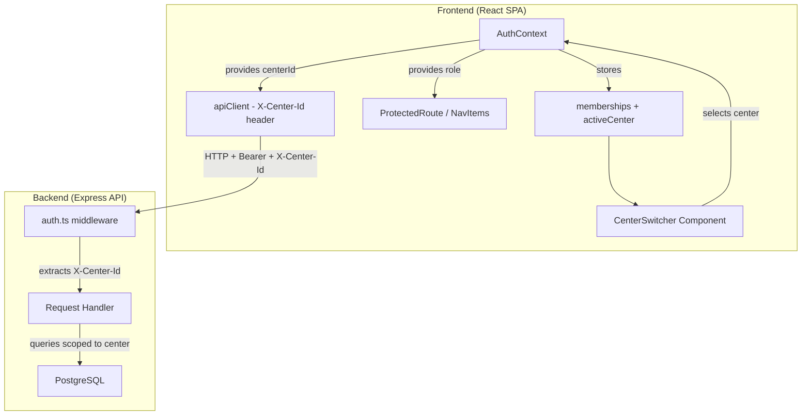

# Design Document: Multi-Center Roles

## Overview

This design replaces the current single-center/single-role data model (`users.center_id` + `users.role`) with a many-to-many `user_center_memberships` table. Each row ties a user to a center with a specific role. The frontend gains a **Center Switcher** in the header, an updated `AuthContext` managing the active center and its per-center role, and all API requests are scoped by an `X-Center-Id` header. The admin panel is enhanced with slug management, head coach invite/reset actions, and a slug change request approval workflow.

### Design Goals

- A single user account can hold different roles at up to 20 centers
- Center switching is instant (no re-login, no page reload beyond data refresh)
- Backward-compatible migration: existing single-center data is migrated non-destructively
- JWT tokens carry the active center ID; membership list is stored client-side
- Slug change requests follow a request → approve/reject lifecycle

---

## Architecture



### Key Architectural Decisions

1. **Header-based center scoping (`X-Center-Id`)** over URL path-based (`/centers/:id/...`): Avoids rewriting every existing route. The middleware reads the header and attaches `req.centerId`.

2. **JWT contains only user ID and active center at issue time**: The client sends `X-Center-Id` on every request; the middleware validates that the user has a membership at that center. This allows center switching without re-issuing tokens.

3. **Membership list in login response (not in JWT)**: Keeps the JWT compact. Memberships are cached in `localStorage` and refreshed on login.

4. **Slug change request as a separate table**: Decouples the approval workflow from the centers table, avoids partial state in the slug column.

---

## Components and Interfaces

### Backend Components

#### 1. New Database Tables

**`user_center_memberships`**

| Column | Type | Constraints | Description |
|--------|------|-------------|-------------|
| id | UUID | PRIMARY KEY, DEFAULT gen_random_uuid() | Record ID |
| user_id | UUID | NOT NULL, FK → users.id ON DELETE CASCADE | User |
| center_id | UUID | NOT NULL, FK → centers.id ON DELETE CASCADE | Center |
| role | VARCHAR(20) | NOT NULL, CHECK (role IN ('HEAD_COACH','ASSISTANT_COACH','STUDENT')) | Role at this center |
| can_access_fees | BOOLEAN | DEFAULT false | Fee access flag |
| created_at | TIMESTAMP | DEFAULT NOW() | Membership creation time (used for ordering) |

**Constraints:**
- UNIQUE(user_id, center_id, role) — prevents exact duplicate memberships
- CHECK: `(SELECT COUNT(*) FROM user_center_memberships WHERE user_id = NEW.user_id) <= 20` enforced via trigger

**Indexes:**
- `idx_ucm_user_id` on (user_id)
- `idx_ucm_center_id` on (center_id)
- `idx_ucm_user_center` on (user_id, center_id)

---

**`slug_change_requests`**

| Column | Type | Constraints | Description |
|--------|------|-------------|-------------|
| id | UUID | PRIMARY KEY, DEFAULT gen_random_uuid() | Request ID |
| center_id | UUID | NOT NULL, FK → centers.id | Requesting center |
| requested_slug | VARCHAR(50) | NOT NULL | Desired new slug |
| status | VARCHAR(10) | NOT NULL, DEFAULT 'PENDING', CHECK (status IN ('PENDING','APPROVED','REJECTED')) | Workflow status |
| requested_by | UUID | NOT NULL, FK → users.id | Head coach who requested |
| reviewed_by | UUID | FK → users.id | Admin who reviewed |
| reviewed_at | TIMESTAMP | | Review timestamp |
| created_at | TIMESTAMP | DEFAULT NOW() | Submission time |

**Indexes:**
- `idx_scr_center_status` on (center_id, status) — fast lookup of pending requests per center
- `idx_scr_status` on (status) — fast count of all pending requests

---

#### 2. Migration Strategy

The migration runs in a single transaction:

```sql
BEGIN;

-- 1. Create user_center_memberships table
CREATE TABLE user_center_memberships ( ... );

-- 2. Populate from existing users table (non-ADMIN users only)
INSERT INTO user_center_memberships (user_id, center_id, role, can_access_fees, created_at)
SELECT id, center_id, role, COALESCE(can_access_fees, false), created_at
FROM users
WHERE role != 'ADMIN' AND center_id IS NOT NULL;

-- 3. Create slug_change_requests table
CREATE TABLE slug_change_requests ( ... );

-- 4. Keep center_id and role columns on users for backward compat during rollout
-- (They become nullable and deprecated — NOT dropped yet)
ALTER TABLE users ALTER COLUMN center_id DROP NOT NULL;
ALTER TABLE users ALTER COLUMN role SET DEFAULT 'HEAD_COACH';

COMMIT;
```

A follow-up migration (after full rollout) will drop `users.center_id` and change `users.role` to only hold `'ADMIN'` or `NULL`.

---

#### 3. Updated Auth Controller (`src/controllers/auth.ts`)

**Login response shape changes:**

```typescript
interface LoginResponse {
  token: string;
  user: UserPublic;
  memberships: Array<{
    centerId: string;
    centerName: string;
    role: UserRole;
    canAccessFees: boolean;
  }>;
  activeCenterId: string;
  activeRole: UserRole;
}
```

**Login logic:**
1. Authenticate username/password (unchanged)
2. Query `user_center_memberships` joined with `centers` for the user
3. If `centerSlug` is provided: find matching membership → set as active, or reject with 403
4. If no slug: select membership with earliest `created_at` → set as active
5. Verify the active center is active and not expired
6. Issue JWT with `{ id, username, centerId: activeCenterId, role: activeRole }`
7. Return full memberships list in response body

---

#### 4. Auth Middleware Update (`src/middleware/auth.ts`)

```typescript
export interface AuthRequest extends Request {
  user?: {
    id: string;
    username: string;
    role: UserRole;       // From JWT (login-time role)
    centerId?: string;    // From X-Center-Id header (runtime)
    jwtCenterId?: string; // Original center from JWT
  };
}
```

The middleware:
1. Decodes JWT as before
2. Reads `X-Center-Id` header (falls back to JWT centerId if not present)
3. If `X-Center-Id` is present and differs from JWT centerId:
   - Queries `user_center_memberships` to validate user has a membership at that center
   - Overwrites `req.user.role` with the role from that membership
   - Sets `req.user.centerId` to the header value
4. If validation fails → 403

---

#### 5. New API Endpoints

| Method | Path | Auth | Description |
|--------|------|------|-------------|
| GET | `/api/memberships/me` | User | Get current user's memberships |
| POST | `/api/admin/centers/:id/invite-coach` | ADMIN | Send invite email to head coach |
| POST | `/api/admin/centers/:id/reset-coach-password` | ADMIN | Send password reset to head coach |
| POST | `/api/slug-change-requests` | HEAD_COACH | Submit a slug change request |
| GET | `/api/admin/slug-change-requests` | ADMIN | List pending requests |
| GET | `/api/admin/slug-change-requests/count` | ADMIN | Get count of pending requests |
| PATCH | `/api/admin/slug-change-requests/:id` | ADMIN | Approve or reject a request |

---

### Frontend Components

#### 1. Updated `AuthContext`

```typescript
interface CenterMembership {
  centerId: string;
  centerName: string;
  role: UserRole;
  canAccessFees: boolean;
}

interface AuthContextInterface {
  user: User | null;
  memberships: CenterMembership[];
  activeCenterId: string | null;
  activeRole: UserRole | null;
  canAccessFees: boolean;
  token: string | null;
  isAuthenticated: boolean;
  login: (username: string, password: string, centerSlug?: string) => Promise<void>;
  logout: () => void;
  switchCenter: (centerId: string) => void;
}
```

**`switchCenter(centerId)`:**
1. Find membership for the given centerId
2. If not found → show error toast, return
3. Update `activeCenterId`, `activeRole`, `canAccessFees` in state
4. Persist `activeCenterId` to `localStorage` key `active_center_id`
5. Trigger re-render (downstream components re-fetch data)

**Session restore:**
- On mount, read `active_center_id` from localStorage
- If it matches a valid membership → use it
- Otherwise → use first membership (earliest created)

---

#### 2. CenterSwitcher Component

```typescript
// src/components/CenterSwitcher.tsx
interface CenterSwitcherProps {}

const CenterSwitcher: React.FC<CenterSwitcherProps> = () => {
  const { memberships, activeCenterId, switchCenter } = useAuth();
  // If only one membership → render center name (no dropdown)
  // If multiple → render dropdown with center names
};
```

Placement: Inside the existing `TopNav` component header area, left of the user avatar.

---

#### 3. Updated `apiClient`

The Axios instance interceptor adds the `X-Center-Id` header from AuthContext's `activeCenterId`:

```typescript
apiClient.interceptors.request.use((config) => {
  const centerId = localStorage.getItem('active_center_id');
  if (centerId) {
    config.headers['X-Center-Id'] = centerId;
  }
  return config;
});
```

---

#### 4. Admin Panel Enhancements

**CenterDetailPage additions:**
- Slug field (editable for ADMIN, read-only otherwise) in the Center Information section
- Head Coach section: display email, "Send Invite" button, "Send Password Reset" button
- Disable invite/reset buttons when no head coach or no email

**AdminDashboardPage:**
- Notification badge on "Slug Requests" nav item showing pending count
- New page: `SlugChangeRequestsPage` listing pending requests with Approve/Reject actions

**Center Admin Settings (non-admin HEAD_COACH view):**
- Read-only slug display with "Request Change" button
- Modal/inline form for submitting new slug value
- Warning if a pending request already exists

---

## Data Models

### TypeScript Types (API)

```typescript
// src/types/index.ts additions

export interface UserCenterMembership {
  id: string;
  userId: string;
  centerId: string;
  role: UserRole;
  canAccessFees: boolean;
  createdAt: Date;
}

export interface SlugChangeRequest {
  id: string;
  centerId: string;
  requestedSlug: string;
  status: 'PENDING' | 'APPROVED' | 'REJECTED';
  requestedBy: string;
  reviewedBy?: string;
  reviewedAt?: Date;
  createdAt: Date;
}

export interface LoginResponseMultiCenter {
  token: string;
  user: Omit<User, 'passwordHash'>;
  memberships: Array<{
    centerId: string;
    centerName: string;
    role: UserRole;
    canAccessFees: boolean;
  }>;
  activeCenterId: string;
  activeRole: UserRole;
}
```

### TypeScript Types (Frontend)

```typescript
// src/types/index.ts additions

export interface CenterMembership {
  centerId: string;
  centerName: string;
  role: UserRole;
  canAccessFees: boolean;
}

export interface SlugChangeRequest {
  id: string;
  centerId: string;
  centerName?: string;
  requestedSlug: string;
  status: 'PENDING' | 'APPROVED' | 'REJECTED';
  requestedBy: string;
  createdAt: string;
}
```

---

## Correctness Properties

*A property is a characteristic or behavior that should hold true across all valid executions of a system — essentially, a formal statement about what the system should do. Properties serve as the bridge between human-readable specifications and machine-verifiable correctness guarantees.*

### Property 1: Membership creation round-trip

*For any* valid user ID, center ID, and role, creating a `user_center_membership` record and then querying it back SHALL return a record with the same user ID, center ID, and role.

**Validates: Requirements 1.1, 1.2**

### Property 2: Duplicate membership rejection

*For any* user ID, center ID, and role combination, if a membership already exists with that exact combination, attempting to create another SHALL be rejected with a duplicate error, and the total membership count for that user at that center SHALL remain unchanged.

**Validates: Requirements 1.3**

### Property 3: Membership capacity limit

*For any* user, creating memberships up to 20 distinct centers SHALL succeed, and attempting to create a 21st membership SHALL be rejected.

**Validates: Requirements 1.4**

### Property 4: Login defaults to earliest membership

*For any* user with N memberships (N ≥ 1) logging in without a center slug, the resolved active center SHALL be the one whose membership has the earliest `created_at` timestamp.

**Validates: Requirements 1.5, 3.5, 7.1**

### Property 5: Membership removal revokes access

*For any* user and center, after removing their membership at that center, all API requests scoped to that center by that user SHALL be rejected with a 403 status.

**Validates: Requirements 1.6**

### Property 6: Active center fallback on removal

*For any* user with N memberships (N ≥ 2) whose active center corresponds to the earliest-created membership, removing that membership SHALL result in the second-earliest membership becoming the new active center.

**Validates: Requirements 1.7**

### Property 7: Role resolution from membership

*For any* user and any center in their membership list, resolving the user's role for that center SHALL return exactly the role stored in the corresponding `user_center_membership` record.

**Validates: Requirements 2.3, 3.1**

### Property 8: Center persistence and localStorage fallback

*For any* user with memberships, if a valid center ID is stored in localStorage, session initialization SHALL use that center as active. If the stored value does not match any current membership, the system SHALL fall back to the first center in the membership list (earliest created).

**Validates: Requirements 2.5, 2.7**

### Property 9: API request center scoping

*For any* authenticated API request made while a center is active, the request SHALL include the active center ID in the `X-Center-Id` header, and the backend SHALL scope data queries to that center ID.

**Validates: Requirements 3.3**

### Property 10: Route guard enforcement per role

*For any* role and any route in the application, if the route is not in the role's permitted route set, navigation to that route SHALL result in a redirect to the Access Denied page (or default route if switching centers).

**Validates: Requirements 3.2, 3.4**

### Property 11: Slug format validation

*For any* string, `validateSlug` SHALL return `valid: true` if and only if the string is 3–50 characters long, contains only lowercase alphanumeric characters and hyphens, starts and ends with an alphanumeric character, and contains no consecutive hyphens.

**Validates: Requirements 4.2, 6.2**

### Property 12: Pending request prevents new submission

*For any* center that already has a slug change request with status PENDING, submitting a new slug change request for that center SHALL be rejected.

**Validates: Requirements 6.4**

### Property 13: Slug change request creation

*For any* valid slug change request (valid format, slug not in use, no pending request for center), creating the request SHALL produce a record with status PENDING, the correct requested_slug, center_id, and a created_at timestamp.

**Validates: Requirements 6.5**

### Property 14: Slug change request approval

*For any* pending slug change request where the requested slug is still not in use, approving it SHALL update the center's slug to the requested value AND set the request status to APPROVED.

**Validates: Requirements 6.7**

### Property 15: Slug change request rejection

*For any* pending slug change request, rejecting it SHALL set the request status to REJECTED AND leave the center's slug unchanged from its value before the rejection.

**Validates: Requirements 6.9**

### Property 16: Pending request count matches badge

*For any* set of slug change requests in the database, the count returned by the pending count endpoint SHALL equal the number of records with status = 'PENDING'.

**Validates: Requirements 6.6**

### Property 17: Branded login membership resolution

*For any* user and center slug, login via branded URL SHALL succeed (setting that center as active) if and only if the user has a membership at the center matching that slug. If no membership exists, login SHALL be rejected with a 403 error.

**Validates: Requirements 7.2, 7.3**

### Property 18: Login response includes all memberships

*For any* user with N memberships, the login response SHALL include exactly N membership entries, each containing a valid center_id and the role matching the corresponding `user_center_membership` record.

**Validates: Requirements 7.4**

### Property 19: JWT token contains active center and role

*For any* successful login, decoding the issued JWT SHALL yield a payload containing the active center ID, the user's role at that center, and an expiration timestamp approximately 24 hours from issue time.

**Validates: Requirements 7.5**

---

## Error Handling

### Backend Error Scenarios

| Scenario | HTTP Status | Error Message | Recovery |
|----------|-------------|---------------|----------|
| Duplicate membership | 409 | "Membership already exists for this user, center, and role" | Client shows inline error |
| Max memberships exceeded | 422 | "User cannot belong to more than 20 centers" | Client shows limit warning |
| Invalid center on switch | 403 | "You do not have a membership at this center" | Client retains previous center |
| Center inactive/expired | 403 | "Center is currently inactive" | Client shows error, blocks access |
| Slug already taken | 409 | "This slug is already taken" | Client shows inline error |
| Slug format invalid | 400 | Specific format error from `validateSlug` | Client shows inline error |
| Pending request exists | 409 | "A pending slug change request already exists" | Client disables submit |
| Slug conflict on approval | 409 | "Slug is no longer available" | Admin sees conflict message |
| No membership for branded login | 403 | "You do not belong to this center" | Client shows login error |
| Email unavailable for action | 422 | "Head coach has no email address on file" | Client shows warning |

### Frontend Error Handling

- **Network errors on center switch**: Show transient toast notification, retain previous center state
- **Invalid stored center on session restore**: Fall back to first membership silently (no error shown)
- **Token expiration during center switch**: Redirect to login page
- **API 403 on scoped request**: If due to membership removal, trigger membership refresh and redirect

---

## Testing Strategy

### Unit Tests (Example-Based)

- CenterSwitcher renders dropdown only when memberships > 1
- CenterSwitcher renders plain text when memberships = 1
- Admin CenterDetailPage shows slug field as editable for ADMIN
- Admin CenterDetailPage shows slug field as read-only for non-ADMIN
- Head coach section shows email instead of user ID
- Invite/reset buttons disabled when no head coach assigned
- Warning shown when head coach has no email
- Network error on switch shows toast and retains previous center
- Center admin settings shows read-only slug with "Request Change" button
- Login as single-center user sets that center as active

### Property-Based Tests (fast-check, 100+ iterations)

Using `fast-check` (already in API devDependencies):

| Property | Test Target | Generator Strategy |
|----------|------------|-------------------|
| Property 1: Membership round-trip | `createMembership` + `getMembership` | Random UUIDs × role enum |
| Property 2: Duplicate rejection | `createMembership` called twice | Same random input |
| Property 3: Capacity limit | Loop `createMembership` 21× | Random user, 21 distinct centers |
| Property 4: Login defaults | `login` with varied memberships | Random membership sets with timestamps |
| Property 5: Removal revokes | `removeMembership` + `apiRequest` | Random membership + request |
| Property 7: Role resolution | `resolveRole(userId, centerId)` | Random memberships |
| Property 8: Persistence fallback | `initSession` | Random localStorage × memberships |
| Property 11: Slug validation | `validateSlug(s)` | Arbitrary strings + valid slugs |
| Property 12: Pending prevents new | `createRequest` with existing pending | Random center with pending |
| Property 14: Approval updates slug | `approveRequest` | Random pending request |
| Property 15: Rejection preserves slug | `rejectRequest` | Random pending request |
| Property 16: Count matches | `getPendingCount` | Random DB state |
| Property 17: Branded login | `login` with/without membership | Random user × slug |
| Property 18: All memberships in response | `login` response check | Random user with N memberships |
| Property 19: JWT content | `decodeJWT` after login | Random login scenarios |

### Integration Tests

- Full login flow with multi-center user (API → JWT → membership list)
- Center switch end-to-end (switch → re-fetch scoped data)
- Slug change request lifecycle (submit → admin list → approve → verify)
- Migration correctness (seed single-center data → run migration → verify memberships)
- Email sending for invite/reset (mock SMTP transport)

### Test Configuration

- Property tests: minimum 100 iterations per property
- Tag format: `Feature: multi-center-roles, Property {N}: {title}`
- Test framework: Jest (API), Vitest (Frontend)
- PBT library: fast-check v4 (already installed in API)
