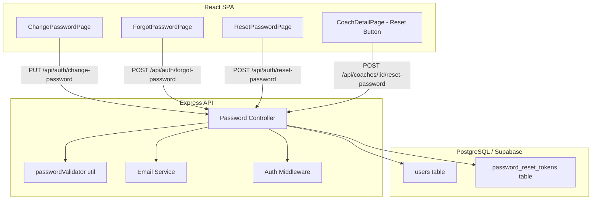
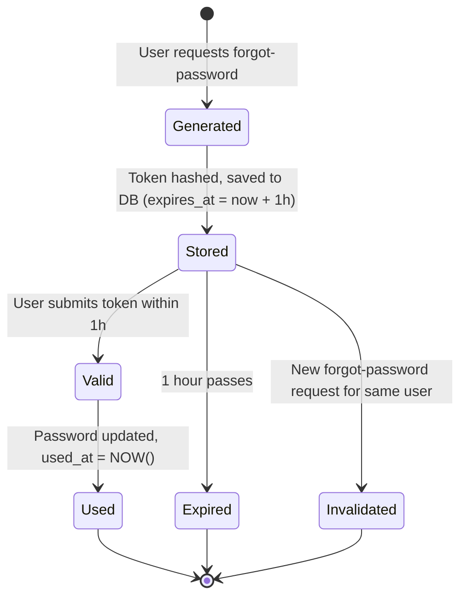

# Design Document: Password Management

## Overview

This design covers three password management flows for the ShuttleCoach platform:

1. **Self-service password change** — Authenticated users verify their current password and set a new one.
2. **Administrative password reset** — HEAD_COACH or ADMIN users reset another user's password directly.
3. **Email-based forgot password** — Unauthenticated users request a time-limited reset link sent to their registered email.

All flows share a common password validation utility enforcing length constraints (8–128 characters). The implementation adds new API endpoints to the existing Express/TypeScript backend, a `password_reset_tokens` PostgreSQL table, a lightweight email service module, and three new frontend pages.

## Architecture



### Request Flow Summary

| Flow | Endpoint | Auth | Key Steps |
|------|----------|------|-----------|
| Self-service change | `PUT /api/auth/change-password` | JWT required | Verify current password → validate new → hash → update |
| Admin reset | `POST /api/coaches/:id/reset-password` | JWT + HEAD_COACH/ADMIN | Authorize → validate new → hash → update → return password |
| Forgot password | `POST /api/auth/forgot-password` | None | Lookup user → generate token → hash token → store → send email |
| Reset with token | `POST /api/auth/reset-password` | None | Hash provided token → lookup in DB → check expiry/used → validate new → update password → mark used |

## Components and Interfaces

### 1. Password Validation Utility

**File:** `src/utils/passwordValidator.ts`

```typescript
import { z } from 'zod';

export const passwordSchema = z
  .string()
  .min(8, 'Password must be at least 8 characters')
  .max(128, 'Password must be at most 128 characters');

export function validatePassword(password: string): { valid: boolean; error?: string } {
  const result = passwordSchema.safeParse(password);
  if (result.success) return { valid: true };
  return { valid: false, error: result.error.issues[0].message };
}
```

### 2. Token Utility

**File:** `src/utils/tokenGenerator.ts`

```typescript
import crypto from 'crypto';

/** Generate a cryptographically random 32-byte token as hex string */
export function generateResetToken(): string {
  return crypto.randomBytes(32).toString('hex');
}

/** Hash a token using SHA-256 for secure storage */
export function hashToken(token: string): string {
  return crypto.createHash('sha256').update(token).digest('hex');
}
```

### 3. Email Service

**File:** `src/services/emailService.ts`

Uses Nodemailer with SMTP configuration (env vars: `SMTP_HOST`, `SMTP_PORT`, `SMTP_USER`, `SMTP_PASS`, `SMTP_FROM`).

```typescript
interface SendResetEmailParams {
  to: string;
  resetLink: string;
  userName: string;
}

export async function sendPasswordResetEmail(params: SendResetEmailParams): Promise<void>;
```

The reset link format: `${FRONTEND_URL}/reset-password?token={rawToken}`

### 4. Password Controller

**File:** `src/controllers/password.ts`

Four handler functions:

| Handler | Route | Description |
|---------|-------|-------------|
| `changePassword` | `PUT /api/auth/change-password` | Authenticated self-service change |
| `adminResetPassword` | `POST /api/coaches/:id/reset-password` | Admin/HEAD_COACH reset for a target user |
| `forgotPassword` | `POST /api/auth/forgot-password` | Generate and email a reset token |
| `resetPassword` | `POST /api/auth/reset-password` | Consume token and set new password |

### 5. Zod Validation Schemas

**File:** `src/validators/password.schemas.ts`

```typescript
export const changePasswordSchema = z.object({
  currentPassword: z.string().min(1, 'Current password is required'),
  newPassword: passwordSchema,
});

export const adminResetPasswordSchema = z.object({
  newPassword: passwordSchema,
});

export const forgotPasswordSchema = z.object({
  email: z.string().email('Invalid email address'),
});

export const resetPasswordSchema = z.object({
  token: z.string().min(1, 'Token is required'),
  newPassword: passwordSchema,
});
```

### 6. Frontend Pages

| Page | Route | Auth | Purpose |
|------|-------|------|---------|
| `ChangePasswordPage` | `/change-password` | Protected (all roles) | Form: current password + new password + confirm |
| `ForgotPasswordPage` | `/forgot-password` | Public | Form: email input → success message |
| `ResetPasswordPage` | `/reset-password` | Public | Form: new password + confirm (token from URL query) |

Additionally, the existing `CoachDetailPage` gets a "Reset Password" button (visible to HEAD_COACH only) that opens a modal/dialog for setting a new password for the coach.

## Data Models

### password_reset_tokens Table

```sql
CREATE TABLE password_reset_tokens (
  id UUID PRIMARY KEY DEFAULT gen_random_uuid(),
  user_id UUID NOT NULL REFERENCES users(id) ON DELETE CASCADE,
  token_hash VARCHAR(64) NOT NULL,
  expires_at TIMESTAMPTZ NOT NULL,
  used_at TIMESTAMPTZ,
  created_at TIMESTAMPTZ NOT NULL DEFAULT NOW()
);

CREATE INDEX idx_password_reset_tokens_token_hash ON password_reset_tokens(token_hash);
CREATE INDEX idx_password_reset_tokens_user_id ON password_reset_tokens(user_id);
```

### Token Lifecycle



### API Request/Response Types

```typescript
// PUT /api/auth/change-password
interface ChangePasswordRequest {
  currentPassword: string;
  newPassword: string;
}

// POST /api/coaches/:id/reset-password
interface AdminResetPasswordRequest {
  newPassword: string;
}
interface AdminResetPasswordResponse {
  message: string;
  newPassword: string; // Returned so admin can share with user
}

// POST /api/auth/forgot-password
interface ForgotPasswordRequest {
  email: string;
}

// POST /api/auth/reset-password
interface ResetPasswordRequest {
  token: string;
  newPassword: string;
}
```

## Correctness Properties

*A property is a characteristic or behavior that should hold true across all valid executions of a system — essentially, a formal statement about what the system should do. Properties serve as the bridge between human-readable specifications and machine-verifiable correctness guarantees.*

### Property 1: Password Validation Accepts Only Valid Lengths

*For any* string, the password validator SHALL accept it if and only if its length is between 8 and 128 characters inclusive.

**Validates: Requirements 5.1, 5.2, 5.3**

### Property 2: Self-Service Password Change Succeeds for All Roles

*For any* authenticated user of any role (ADMIN, HEAD_COACH, ASSISTANT_COACH, STUDENT), when they supply the correct current password and a valid new password, the password change SHALL succeed and the stored hash SHALL verify against the new password.

**Validates: Requirements 1.1, 1.6**

### Property 3: Incorrect Current Password Rejection

*For any* authenticated user and any password that does not match their stored hash, a password change request SHALL be rejected with a 401 status.

**Validates: Requirements 1.2**

### Property 4: Administrative Reset Authorization

*For any* user attempting an administrative password reset: if the user's role is HEAD_COACH, the request SHALL succeed only if the target user belongs to the same center; if the user's role is ADMIN, the request SHALL succeed regardless of center; if the user has any other role, the request SHALL be rejected with 403.

**Validates: Requirements 2.1, 2.2, 2.4, 2.5**

### Property 5: Token Storage is Hashed

*For any* forgot-password request for a registered email, the token stored in the database SHALL be a SHA-256 hash of the raw token, and SHALL NOT equal the raw token value.

**Validates: Requirements 3.1, 3.9**

### Property 6: Email Enumeration Prevention

*For any* forgot-password request, the API response SHALL be identical (200 status, same message shape) regardless of whether the email matches a registered user. An email SHALL be sent only when the email matches a registered user.

**Validates: Requirements 3.7**

### Property 7: Token Invalidation on New Request

*For any* user with existing reset tokens, when a new forgot-password request is submitted for that user, all previously stored tokens for that user SHALL be invalidated (deleted or marked used) before the new token is stored.

**Validates: Requirements 3.8**

### Property 8: Valid Token Resets Password and is Consumed

*For any* valid (non-expired, non-used) reset token and a valid new password, submitting a reset request SHALL update the user's password hash to verify against the new password, AND SHALL mark the token's `used_at` with a timestamp, making it unusable for subsequent requests.

**Validates: Requirements 3.4, 4.3, 4.4**

### Property 9: Reset Email Contains Valid Link

*For any* forgot-password request for a registered email, the email service SHALL be called with a reset link containing the raw (unhashed) token, addressed to the user's registered email.

**Validates: Requirements 3.2**

## Error Handling

| Scenario | Status | Error Message |
|----------|--------|---------------|
| Missing/invalid JWT on authenticated endpoint | 401 | "No token provided" / "Invalid or expired token" |
| Wrong current password (change flow) | 401 | "Invalid current password" |
| Password too short (< 8) | 400 | "Password must be at least 8 characters" |
| Password too long (> 128) | 400 | "Password must be at most 128 characters" |
| Unauthorized role for admin reset | 403 | "You do not have permission to perform this action" |
| HEAD_COACH targeting user outside center | 403 | "You can only reset passwords for users in your center" |
| Target user not found (admin reset) | 404 | "User not found" |
| Expired reset token | 400 | "Token expired" |
| Invalid or used reset token | 400 | "Invalid token" |
| Email service failure | 500 | Logged internally; user still sees 200 (to prevent enumeration leak via timing) |
| Database error | 500 | "An error occurred" |

### Rate Limiting Considerations

- **Forgot password endpoint**: Limit to 3 requests per email per 15 minutes (prevents abuse).
- **Change password endpoint**: Limit to 5 attempts per user per 15 minutes (prevents brute-force of current password).
- Implementation: Simple in-memory rate limiter (e.g., `express-rate-limit`) scoped to these specific routes. For production scale, move to Redis-backed limiter.

## Testing Strategy

### Property-Based Tests (fast-check)

The project already has `fast-check` as a dev dependency. Each correctness property maps to a property-based test with minimum 100 iterations.

| Property | Test File | Description |
|----------|-----------|-------------|
| 1 | `password.validator.property.test.ts` | Random strings validate correctly by length |
| 2 | `password.change.property.test.ts` | All roles can change with correct current password |
| 3 | `password.change.property.test.ts` | Wrong passwords always rejected |
| 4 | `password.admin-reset.property.test.ts` | Authorization rules hold across role/center combos |
| 5 | `password.token.property.test.ts` | Stored token is SHA-256 hash, never equals raw |
| 6 | `password.forgot.property.test.ts` | Response shape identical for registered/unregistered emails |
| 7 | `password.forgot.property.test.ts` | Existing tokens invalidated on new request |
| 8 | `password.reset.property.test.ts` | Valid token consumption updates password and marks used |
| 9 | `password.forgot.property.test.ts` | Email contains correct reset link |

**Configuration:**
- Library: `fast-check` (already in devDependencies)
- Minimum iterations: 100 per property
- Tag format: `Feature: password-management, Property {N}: {title}`

### Unit Tests (Jest)

- Specific example tests for response shapes (success messages, error messages)
- Edge cases: empty strings, exactly 8 chars, exactly 128 chars, 129 chars
- Token expiry boundary (created 59 min ago vs 61 min ago)

### Integration Tests

- Full flow tests using supertest against the Express app (with test DB)
- Verify email service mock is called with correct parameters
- Verify database state changes (hash updated, token rows created/invalidated)

### Smoke Tests

- Migration runs without error and creates the `password_reset_tokens` table with correct schema
- Foreign key constraint is enforced (inserting token with non-existent user_id fails)
