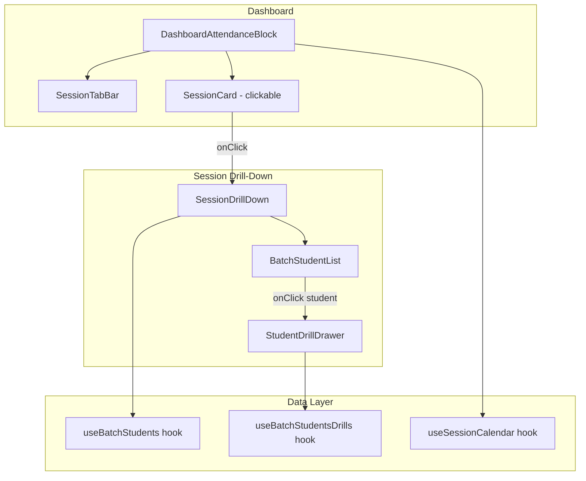
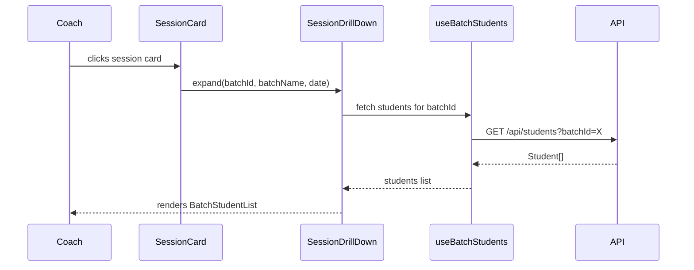
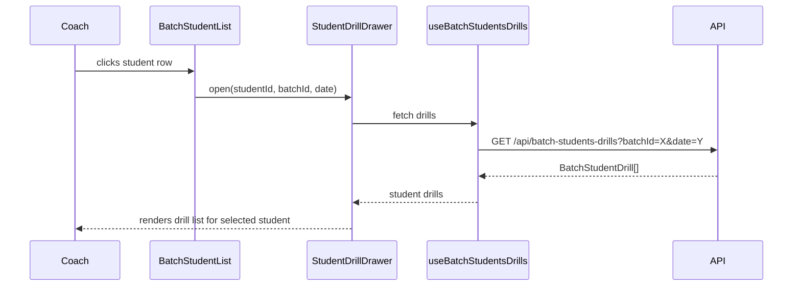

# Design Document: Session Drill-Down

## Overview

The Session Drill-Down feature enables coaches to interactively explore session details from the dashboard. When a coach clicks on a session card in the "Today's Sessions" area, an inline expansion reveals the list of students enrolled in that batch. Clicking on a student shows the drills they should practice today based on the batch's curriculum plan for the current week.

This design favors inline expansion (accordion-style) for the batch→students level to keep the coach in context on the dashboard, and a slide-over drawer for the student→drills level to provide focused drill information without full page navigation. The existing `useBatchStudents` and `useBatchStudentsDrills` hooks already support the required data fetching, so this feature primarily introduces new UI components and interaction patterns on top of existing data infrastructure.

## Architecture



## Sequence Diagrams

### Flow 1: Coach clicks session card → sees students



### Flow 2: Coach clicks student → sees today's drills



## Components and Interfaces

### Component 1: SessionDrillDown

**Purpose**: Expandable panel that appears below a session card when clicked. Shows the list of students enrolled in the selected batch.

**Interface**:
```typescript
interface SessionDrillDownProps {
  /** The calendar entry for the selected session */
  session: CalendarEntry;
  /** Whether this panel is currently expanded */
  isExpanded: boolean;
  /** Callback to collapse the panel */
  onCollapse: () => void;
}
```

**Responsibilities**:
- Fetch students for the session's batchId using `useBatchStudents`
- Render an animated slide-down panel with student list
- Track which student is selected for drill viewing
- Open `StudentDrillDrawer` when a student is clicked

### Component 2: BatchStudentList

**Purpose**: Renders the list of students within the expanded session panel. Each student row is clickable and shows basic info (name, skill level).

**Interface**:
```typescript
interface BatchStudentListProps {
  /** Students in the batch */
  students: Student[];
  /** Loading state while fetching students */
  loading: boolean;
  /** Error message if fetch failed */
  error: string | null;
  /** Callback when a student is clicked */
  onStudentClick: (student: Student) => void;
  /** Currently selected student ID (for highlight) */
  selectedStudentId?: string;
}
```

**Responsibilities**:
- Display student list with name, skill level badge
- Handle loading and error states
- Highlight selected student
- Emit click event to parent

### Component 3: StudentDrillDrawer

**Purpose**: Slide-over drawer that displays today's drills for a selected student. Overlays from the right side of the viewport.

**Interface**:
```typescript
interface StudentDrillDrawerProps {
  /** Whether the drawer is open */
  isOpen: boolean;
  /** Callback to close the drawer */
  onClose: () => void;
  /** Student info */
  student: Student;
  /** Batch ID for drill lookup */
  batchId: string;
  /** Session date (today's date as ISO string) */
  sessionDate: string;
}
```

**Responsibilities**:
- Fetch drill data using `useBatchStudentsDrills` hook
- Display drill list grouped by focus area
- Render student header with name and skill level
- Provide close button and backdrop click to dismiss
- Handle loading/error states gracefully

### Component 4: SessionCardClickable (enhanced SessionCard)

**Purpose**: Wraps existing SessionEntry UI with click handler to trigger drill-down expansion.

**Interface**:
```typescript
interface SessionCardClickableProps extends SessionCardProps {
  /** Callback when a session entry is clicked */
  onSessionClick?: (entry: CalendarEntry) => void;
  /** Currently expanded session batchId (to show active state) */
  expandedBatchId?: string;
}
```

**Responsibilities**:
- Add cursor pointer and hover state to session entries
- Emit click event with the CalendarEntry data
- Show visual indicator (chevron rotation) when expanded

## Data Models

### CalendarEntry (existing)

```typescript
interface CalendarEntry {
  date: string;
  dayOfWeek: DayOfWeek;
  startTime: string;
  endTime: string;
  batchId: string;
  batchName: string;
  weekNumber: number;
  focusArea: string;
  drills: string[];
  attendanceRecorded: boolean;
  coachNote?: string;
}
```

### BatchStudentDrill (existing)

```typescript
interface BatchStudentDrill {
  studentId: string;
  fullName: string;
  skillLevel: SkillLevel;
  drills: Array<{ name: string; focusArea: string }>;
}
```

### SessionDrillDownState (new, local component state)

```typescript
interface SessionDrillDownState {
  /** Which session card is currently expanded (null = none) */
  expandedSessionKey: string | null;
  /** Which student's drawer is open (null = none) */
  selectedStudent: Student | null;
  /** Whether the drill drawer is open */
  drawerOpen: boolean;
}
```

**Validation Rules**:
- Only one session can be expanded at a time
- expandedSessionKey is composed as `${batchId}-${date}` for uniqueness
- Selecting a different session collapses the current one
- Closing the drawer resets selectedStudent to null

## Algorithmic Pseudocode

### Main Interaction Algorithm

```typescript
/**
 * ALGORITHM: handleSessionClick
 * 
 * Preconditions:
 *   - session is a valid CalendarEntry with batchId and date
 *   - component is mounted and state is initialized
 * 
 * Postconditions:
 *   - If same session clicked: panel collapses (expandedSessionKey = null)
 *   - If different session clicked: previous panel collapses, new one expands
 *   - Drawer is closed when switching sessions
 */
function handleSessionClick(session: CalendarEntry): void {
  const key = `${session.batchId}-${session.date}`;
  
  if (state.expandedSessionKey === key) {
    // Toggle off - collapse current panel
    setState({ expandedSessionKey: null, selectedStudent: null, drawerOpen: false });
  } else {
    // Expand new session, collapse any previous
    setState({ expandedSessionKey: key, selectedStudent: null, drawerOpen: false });
  }
}
```

### Student Selection Algorithm

```typescript
/**
 * ALGORITHM: handleStudentClick
 * 
 * Preconditions:
 *   - student is a valid Student from the batch student list
 *   - session panel is currently expanded
 * 
 * Postconditions:
 *   - selectedStudent is set to the clicked student
 *   - drawerOpen is true
 *   - useBatchStudentsDrills will be triggered with correct params
 */
function handleStudentClick(student: Student): void {
  setState({ selectedStudent: student, drawerOpen: true });
}
```

### Drill Data Resolution

```typescript
/**
 * ALGORITHM: resolveTodaysDrills
 * 
 * Preconditions:
 *   - batchId is a valid batch identifier
 *   - date is today's date in YYYY-MM-DD format
 *   - API endpoint /api/batch-students-drills exists and is accessible
 * 
 * Postconditions:
 *   - Returns array of BatchStudentDrill entries for all students in batch
 *   - Each entry contains drills mapped from curriculum plan for current week
 *   - If no curriculum plan exists, drills array is empty
 * 
 * Loop Invariants: N/A (single API call, no iteration)
 */
async function resolveTodaysDrills(batchId: string, date: string): Promise<BatchStudentDrill[]> {
  // The existing API endpoint handles:
  // 1. Find curriculum plan for batch
  // 2. Determine current week number from cycle start date
  // 3. Get WeekPlan.drills for that week
  // 4. Return per-student drill assignments
  const response = await apiClient.get('/batch-students-drills', {
    params: { batchId, date }
  });
  return response.data.students;
}
```

## Key Functions with Formal Specifications

### useSessionDrillDown() — Custom Hook

```typescript
function useSessionDrillDown(): {
  expandedSessionKey: string | null;
  selectedStudent: Student | null;
  drawerOpen: boolean;
  handleSessionClick: (session: CalendarEntry) => void;
  handleStudentClick: (student: Student) => void;
  closeDrawer: () => void;
  collapseAll: () => void;
}
```

**Preconditions:**
- Hook is called within a React component
- Component is within the Router context

**Postconditions:**
- State transitions are consistent (no drawer without expanded session)
- Only one session expanded at any time
- Closing drawer preserves expanded session
- collapseAll resets all state to initial

### getSessionKey() — Utility

```typescript
function getSessionKey(entry: CalendarEntry): string
```

**Preconditions:**
- `entry.batchId` is a non-empty string
- `entry.date` is a valid YYYY-MM-DD string

**Postconditions:**
- Returns a deterministic, unique string for the session
- Same entry always produces the same key
- Different batch+date combinations produce different keys

## Example Usage

```typescript
// Inside HeadCoachDashboard or DashboardAttendanceBlock
import { useSessionDrillDown } from '../hooks/useSessionDrillDown';
import { SessionDrillDown } from '../components/SessionDrillDown';
import { StudentDrillDrawer } from '../components/StudentDrillDrawer';

const MyDashboard: React.FC = () => {
  const { entries: calendarEntries } = useSessionCalendar({ startDate, endDate });
  const {
    expandedSessionKey,
    selectedStudent,
    drawerOpen,
    handleSessionClick,
    handleStudentClick,
    closeDrawer,
  } = useSessionDrillDown();

  const todaySessions = calendarEntries.filter(e => e.date === todayStr);

  return (
    <div>
      {todaySessions.map((session) => {
        const key = getSessionKey(session);
        return (
          <div key={key}>
            {/* Clickable session entry */}
            <SessionEntryClickable
              entry={session}
              isExpanded={expandedSessionKey === key}
              onClick={() => handleSessionClick(session)}
            />

            {/* Expandable drill-down panel */}
            {expandedSessionKey === key && (
              <SessionDrillDown
                session={session}
                isExpanded={true}
                onCollapse={() => handleSessionClick(session)}
                onStudentClick={handleStudentClick}
              />
            )}
          </div>
        );
      })}

      {/* Student drill drawer */}
      {selectedStudent && (
        <StudentDrillDrawer
          isOpen={drawerOpen}
          onClose={closeDrawer}
          student={selectedStudent}
          batchId={expandedSessionKey?.split('-')[0] ?? ''}
          sessionDate={todayStr}
        />
      )}
    </div>
  );
};
```

## Correctness Properties

*A property is a characteristic or behavior that should hold true across all valid executions of a system — essentially, a formal statement about what the system should do. Properties serve as the bridge between human-readable specifications and machine-verifiable correctness guarantees.*

### Property 1: Session Toggle Behavior

*For any* session and any current expansion state, clicking a session that is already expanded collapses it (sets expandedSessionKey to null), and clicking a session that is not expanded sets expandedSessionKey to that session's key while closing any previously expanded session.

**Validates: Requirements 1.1, 1.2, 1.4**

### Property 2: Single Expansion Invariant

*For any* sequence of session click operations, the expandedSessionKey state is either null or contains exactly one session key — never more than one session is expanded simultaneously.

**Validates: Requirements 1.3, 4.1**

### Property 3: Drawer-Session State Consistency

*For any* state where drawerOpen is true, expandedSessionKey is non-null and selectedStudent is non-null. Additionally, switching to a different session closes the drawer, and closing the drawer preserves the expanded session.

**Validates: Requirements 4.2, 4.3, 4.4, 3.1, 3.5**

### Property 4: Session Key Determinism

*For any* CalendarEntry, the getSessionKey function always produces the same string output when called multiple times with the same entry.

**Validates: Requirements 8.1, 8.2**

### Property 5: Session Key Uniqueness

*For any* two CalendarEntries with different batchId or different date values, getSessionKey produces different keys.

**Validates: Requirements 8.3**

### Property 6: Student List Rendering Completeness

*For any* non-empty list of students, the rendered BatchStudentList contains each student's name and skill level.

**Validates: Requirements 2.2**

### Property 7: Drill Grouping by Focus Area

*For any* set of drill assignments, the StudentDrillDrawer renders drills grouped by their focusArea field, with all drills of the same focus area appearing together.

**Validates: Requirements 3.3**

## Error Handling

### Error Scenario 1: Student Fetch Failure

**Condition**: `useBatchStudents` API call fails (network error, 500, or 403)
**Response**: Display inline error message within the expanded panel: "Failed to load students. Please try again."
**Recovery**: Show a retry button that calls `refetch()`. Collapsing and re-expanding also triggers a fresh fetch.

### Error Scenario 2: Drill Fetch Failure

**Condition**: `useBatchStudentsDrills` API call fails
**Response**: Display error within the drawer: "Student data temporarily unavailable"
**Recovery**: Close and re-open the drawer triggers a new fetch. The drawer remains dismissible.

### Error Scenario 3: No Curriculum Plan Assigned

**Condition**: Batch has no active curriculum plan for the current cycle
**Response**: The API returns students with empty `drills[]` arrays. Drawer shows: "No drills assigned for today. Please set up a curriculum plan for this batch."
**Recovery**: Link to the curriculum setup page (`/curriculum/student/:studentId`)

### Error Scenario 4: Empty Batch (No Students)

**Condition**: Batch exists but has no enrolled students
**Response**: Expanded panel shows: "No students enrolled in this batch yet."
**Recovery**: No action needed — informational only.

## Testing Strategy

### Unit Testing Approach

- **useSessionDrillDown hook**: Test state transitions — expand, collapse, toggle, student selection, drawer open/close
- **getSessionKey**: Verify uniqueness and determinism
- **SessionDrillDown**: Render with mock students, verify list renders correctly
- **BatchStudentList**: Test click handlers, loading/error states, selected state highlight
- **StudentDrillDrawer**: Test open/close, drill list rendering, error state

### Property-Based Testing Approach

**Property Test Library**: fast-check

- **Toggle idempotence**: For any sequence of session clicks, the final state is predictable (same session twice = collapsed)
- **Single expansion**: After any sequence of operations, at most one session key is in expanded state
- **Drawer consistency**: If drawer is open, expanded session and student are non-null

### Integration Testing Approach

- Mock API responses and verify full flow: click session → students appear → click student → drills appear
- Test error boundary: API returns 500 → error message shown → retry works
- Test rapid interactions: expand session A, immediately expand session B → only B is expanded

## Performance Considerations

- **Lazy loading**: Student list is fetched only when a session is expanded, not preloaded for all sessions
- **No redundant fetches**: `useBatchStudents` hook tracks batchId and only refetches on change
- **Animation performance**: CSS transitions for expand/collapse use `max-height` + `overflow: hidden` (GPU-compositable)
- **Drawer backdrop**: Uses `position: fixed` with `pointer-events` toggling to avoid layout thrash
- **Session calendar cache**: The existing `useSessionCalendar` hook caches data in sessionStorage with daily TTL

## Security Considerations

- **Authorization**: The `useBatchStudentsDrills` API endpoint already returns 403 for coaches not assigned to the batch — the UI respects this and shows an appropriate error
- **Data scoping**: Students are always fetched with `batchId` filter — no risk of leaking cross-batch data
- **No sensitive data exposure**: Student drill data contains only names and drill assignments, no PII beyond what's already visible on the dashboard

## Dependencies

| Dependency | Purpose | Status |
|---|---|---|
| `useBatchStudents` hook | Fetch students by batchId | Existing |
| `useBatchStudentsDrills` hook | Fetch student drills for date | Existing |
| `useSessionCalendar` hook | Provide CalendarEntry data | Existing |
| `CalendarEntry` type | Session data shape | Existing |
| `BatchStudentDrill` type | Student drill data shape | Existing |
| `Student` type | Student model | Existing |
| React Router (react-router-dom) | Navigation context | Existing |
| CSS design tokens (var(--*)) | Styling consistency | Existing |
