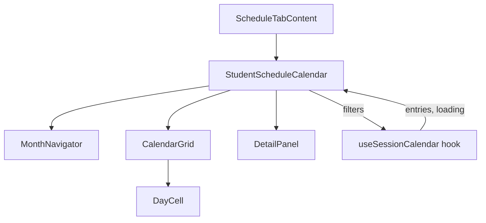

# Design Document: Student Schedule Calendar

## Overview

The Student Schedule Calendar replaces the existing list-based session display in the Schedule tab of `StudentProfilePage` with a visual monthly grid. The component is a pure frontend addition—no backend changes needed. It reuses the existing `useSessionCalendar` hook to fetch `CalendarEntry` data and presents it in a CSS Grid calendar layout with month navigation and an inline detail panel.

Key design goals:
- Zero new dependencies (CSS Grid, no external calendar libraries)
- Familiar calendar UX: month grid, prev/next navigation, click-to-reveal details
- Responsive down to 600px viewport width
- Minimal state: selected date + viewed month

## Architecture



The `StudentScheduleCalendar` component is the top-level orchestrator. It owns the viewed-month state and selected-date state. It passes filter params (startDate, endDate, batchId) to `useSessionCalendar`, receives entries, and distributes data to child components.

### Component Hierarchy

| Component | Responsibility |
|-----------|---------------|
| `StudentScheduleCalendar` | State owner (viewedMonth, selectedDate). Computes grid days. Passes data down. |
| `MonthNavigator` | Renders month/year label and prev/next buttons. Emits navigation events. |
| `CalendarGrid` | Renders the 7-column CSS Grid of `DayCell` components. |
| `DayCell` | Renders a single day cell. Applies highlight/today/muted styles. Handles click. |
| `DetailPanel` | Renders session details (time, focus area, drills) for the selected date. |

### Data Flow

1. `StudentScheduleCalendar` computes `startDate` (1st of viewed month) and `endDate` (last of viewed month).
2. These are passed to `useSessionCalendar({ startDate, endDate, batchId })`.
3. Hook returns `{ entries, loading, error, refetch }`.
4. Component builds a `Map<string, CalendarEntry[]>` keyed by date string for O(1) lookup.
5. Grid days are computed from the viewed month (including leading/trailing fill days).
6. Each `DayCell` receives its date, whether it has entries, and whether it is the selected date.
7. On day click: if entries exist for that date, set `selectedDate`; otherwise clear it.
8. `DetailPanel` reads entries for `selectedDate` from the map.

## Components and Interfaces

### StudentScheduleCalendar

```typescript
interface StudentScheduleCalendarProps {
  batchId: string;
}

// Internal state
interface CalendarState {
  viewedYear: number;
  viewedMonth: number; // 0-indexed (JS Date convention)
  selectedDate: string | null; // ISO date string or null
}
```

### MonthNavigator

```typescript
interface MonthNavigatorProps {
  year: number;
  month: number; // 0-indexed
  onPrev: () => void;
  onNext: () => void;
}
```

### CalendarGrid

```typescript
interface CalendarGridProps {
  days: GridDay[];
  entriesByDate: Map<string, CalendarEntry[]>;
  selectedDate: string | null;
  onDayClick: (date: string) => void;
}
```

### DayCell

```typescript
interface DayCellProps {
  day: GridDay;
  hasEntries: boolean;
  isSelected: boolean;
  isToday: boolean;
  onClick: () => void;
}
```

### DetailPanel

```typescript
interface DetailPanelProps {
  entries: CalendarEntry[];
  date: string;
  onClose: () => void;
}
```

### Utility Types

```typescript
interface GridDay {
  date: string;       // ISO date string (YYYY-MM-DD)
  dayNumber: number;  // 1-31
  isCurrentMonth: boolean;
}
```

## Data Models

The component consumes the existing `CalendarEntry` type without modification:

```typescript
interface CalendarEntry {
  date: string;              // "YYYY-MM-DD"
  dayOfWeek: DayOfWeek;     // 0-6 (Sun-Sat)
  startTime: string;        // "HH:MM"
  endTime: string;          // "HH:MM"
  batchId: string;
  batchName: string;
  weekNumber: number;
  focusArea: string;
  drills: string[];
  attendanceRecorded: boolean;
  coachNote?: string;
}
```

### Computed Data Structures

**Grid Days Computation** (`buildGridDays(year, month)`):

1. Determine the first day of the month and its weekday (0=Sun).
2. Determine the last day of the month.
3. Add leading days from previous month to fill the first row from Sunday.
4. Add all days of the current month.
5. Add trailing days from next month to complete the last row through Saturday.
6. Result: array of `GridDay` objects whose length is always a multiple of 7.

**Entries Lookup Map** (`buildEntriesMap(entries)`):

```typescript
// O(n) build, O(1) lookup per day
const entriesByDate = new Map<string, CalendarEntry[]>();
entries.forEach(entry => {
  const existing = entriesByDate.get(entry.date) || [];
  existing.push(entry);
  entriesByDate.set(entry.date, existing);
});
```

### Date Computation for Hook Filters

```typescript
function getMonthDateRange(year: number, month: number) {
  const startDate = `${year}-${String(month + 1).padStart(2, '0')}-01`;
  const lastDay = new Date(year, month + 1, 0).getDate();
  const endDate = `${year}-${String(month + 1).padStart(2, '0')}-${String(lastDay).padStart(2, '0')}`;
  return { startDate, endDate };
}
```

## Correctness Properties

*A property is a characteristic or behavior that should hold true across all valid executions of a system—essentially, a formal statement about what the system should do. Properties serve as the bridge between human-readable specifications and machine-verifiable correctness guarantees.*

### Property 1: Grid cell count is a multiple of 7 and covers all month dates

*For any* valid year (1970–2100) and month (0–11), the `buildGridDays` function SHALL return an array whose length is a multiple of 7, and which contains exactly one `GridDay` with `isCurrentMonth: true` for every day in that month (from 1 through the last day of the month).

**Validates: Requirements 1.2**

### Property 2: Day cell highlight if and only if entries exist

*For any* set of `CalendarEntry` records and any grid of day cells, a day cell SHALL be marked as highlighted if and only if the entries map contains at least one entry for that cell's date.

**Validates: Requirements 2.1, 2.3**

### Property 3: Detail panel renders all entry data for selected date

*For any* non-empty list of `CalendarEntry` records associated with a selected date, the detail panel output SHALL contain the startTime, endTime, focusArea, and every element of the drills[] array from each entry.

**Validates: Requirements 3.2, 3.3**

### Property 4: Month navigation changes month by exactly ±1

*For any* starting year and month, invoking "previous" SHALL result in the viewed month being (month - 1) with correct year rollover (Dec → Nov, Jan → Dec of previous year), and invoking "next" SHALL result in (month + 1) with correct year rollover (Dec → Jan of next year).

**Validates: Requirements 4.2, 4.3**

### Property 5: Hook receives first and last date of viewed month

*For any* viewed year and month, the startDate passed to `useSessionCalendar` SHALL equal the first day of that month (YYYY-MM-01) and the endDate SHALL equal the last day of that month (YYYY-MM-DD where DD is the month's last date).

**Validates: Requirements 4.4, 6.3**

## Error Handling

| Scenario | Behavior |
|----------|----------|
| `useSessionCalendar` returns error | Render empty calendar grid (no highlights). The hook already swallows network errors and returns `entries: []`. |
| No batch assigned | Show "No batch assigned" message instead of calendar. Same behavior as current implementation. |
| Empty entries for viewed month | Render full grid with no highlighted days. Show inline message: "No sessions scheduled this month." |
| Invalid date in CalendarEntry | Skip entry during map building (defensive filter on date format). |
| Click outside Detail Panel | Close panel via `onClose` handler. |

## Testing Strategy

### Unit Tests (Example-Based)

| Test Case | Validates |
|-----------|-----------|
| Renders 7 column headers (Sun–Sat) when batch assigned | Req 1.1 |
| Leading/trailing days have muted CSS class | Req 1.3 |
| Today's date has today-indicator class | Req 1.4 |
| Clicking session day opens detail panel | Req 3.1 |
| Clicking non-session day does not open panel | Req 3.4 |
| Clicking different session day updates panel | Req 3.5 |
| Close button / click-outside closes panel | Req 3.6 |
| Month/year label displays correctly | Req 4.1 |
| Month navigation closes open detail panel | Req 4.5 |
| Loading indicator shown while loading | Req 5.1 |
| No-batch message when batchId is empty | Req 5.2 |
| Empty-month message when entries is [] | Req 5.3 |
| Batch change triggers refetch | Req 6.2 |

### Property-Based Tests

Library: **fast-check** (already compatible with Vitest)

Each property test runs a minimum of **100 iterations** with generated inputs.

| Property | Tag |
|----------|-----|
| Grid cell count & coverage | Feature: student-schedule-calendar, Property 1: Grid cell count is a multiple of 7 and covers all month dates |
| Highlight iff entries exist | Feature: student-schedule-calendar, Property 2: Day cell highlight if and only if entries exist |
| Detail panel data completeness | Feature: student-schedule-calendar, Property 3: Detail panel renders all entry data for selected date |
| Month navigation arithmetic | Feature: student-schedule-calendar, Property 4: Month navigation changes month by exactly ±1 |
| Hook date params correctness | Feature: student-schedule-calendar, Property 5: Hook receives first and last date of viewed month |

### Test File Location

- `src/components/StudentScheduleCalendar/StudentScheduleCalendar.test.tsx` — unit tests
- `src/components/StudentScheduleCalendar/StudentScheduleCalendar.property.test.ts` — property-based tests (pure logic: grid computation, date math, highlight logic)
