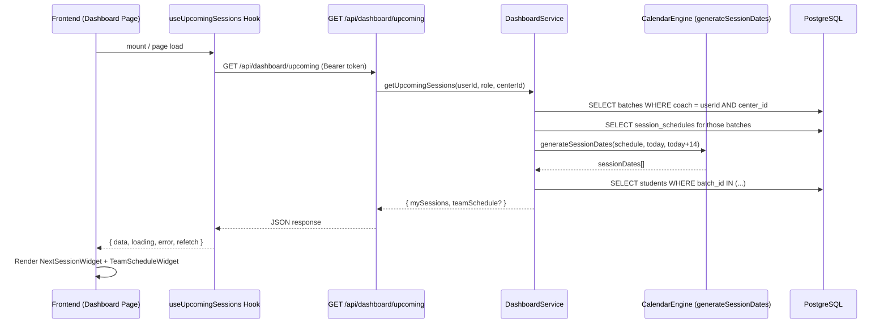
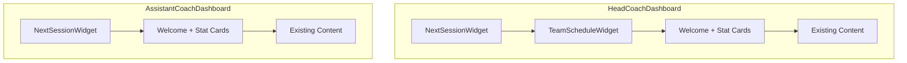

# Design Document: Upcoming Batches Dashboard

## Overview

This feature adds an "Upcoming Batches" section to both the HeadCoachDashboard and AssistantCoachDashboard pages, providing coaches with at-a-glance visibility into their next scheduled session. The implementation consists of:

1. **A new API endpoint** (`GET /api/dashboard/upcoming`) that computes the next session for the requesting coach's batches and, for HEAD_COACHes, a team-wide schedule.
2. **A service function** (`getUpcomingSessions`) that leverages the existing calendar engine's recurrence logic to find the next session within a 14-day lookahead window.
3. **Two new React components** — `NextSessionWidget` and `TeamScheduleWidget` — integrated at the top of existing dashboard pages.

### Design Decisions

| Decision | Rationale |
|----------|-----------|
| Single endpoint for both roles | Reduces frontend complexity — one hook, conditional rendering based on presence of `teamSchedule` |
| Reuse `generateSessionDates` logic from calendarEngine | Avoids duplicating recurrence computation; the calendar engine already handles all edge cases (repeat intervals, end boundaries) |
| 14-day lookahead for own sessions, 7-day for team | Own sessions need more advance visibility; team schedule is a quick operational check |
| No caching (fresh fetch on each page load) | Dashboard data must be current; session schedules can change at any time |
| Server-side sorting for teamSchedule | Guarantees consistent ordering regardless of frontend rendering |

---

## Architecture



### Component Placement



---

## Components and Interfaces

### Backend

#### Route: `GET /api/dashboard/upcoming`

| Aspect | Detail |
|--------|--------|
| Path | `/api/dashboard/upcoming` |
| Method | GET |
| Middleware | `authenticate` → `centerActive` → `tenantScope` |
| Allowed roles | `HEAD_COACH`, `ASSISTANT_COACH` |
| Query params | None |

#### Controller: `getUpcomingDashboardHandler`

File: `src/controllers/dashboard.ts`

Responsibilities:
- Extract `userId`, `role`, `centerId` from `req.user` / `req.tenantCenterId`
- Call service function `getUpcomingSessions()`
- Return shaped response

#### Service: `getUpcomingSessions`

File: `src/services/dashboard.ts`

```typescript
interface UpcomingSession {
  batchId: string;
  batchName: string;
  date: string;        // YYYY-MM-DD
  startTime: string;   // HH:MM
  endTime: string;     // HH:MM
  students: Array<{
    id: string;
    fullName: string;
    profilePhoto: string | null;
  }>;
}

interface TeamScheduleEntry {
  coachId: string;
  coachName: string;
  batchId: string;
  batchName: string;
  date: string;        // YYYY-MM-DD
  startTime: string;   // HH:MM
  endTime: string;     // HH:MM
  studentCount: number;
}

interface UpcomingDashboardResponse {
  mySessions: UpcomingSession[];
  teamSchedule?: TeamScheduleEntry[];  // Only present for HEAD_COACH
}
```

**Logic flow:**

1. Query `batches` table for batches assigned to the requesting coach (via `head_coach_id` or `assistant_coach_id`), scoped by `center_id`.
2. For each batch, fetch `session_schedules`.
3. For each schedule, compute the next session date using the recurrence logic (adapted from `generateSessionDates` in calendarEngine). Apply "today counts if not ended" rule by comparing current time to `endTime`.
4. If a batch has no schedule or the recurrence has ended, skip it.
5. For each batch with a valid next session, query students enrolled in that batch.
6. If role is `HEAD_COACH`, additionally query all batches in the center (across all coaches), compute next sessions within 7 days, and aggregate into `teamSchedule`.
7. Sort `teamSchedule` by date ASC, then startTime ASC.

#### Helper: `computeNextSession`

A focused pure function extracted from the calendar engine's `generateSessionDates` logic:

```typescript
function computeNextSession(
  schedule: SessionSchedule,
  referenceDate: Date,     // typically "now"
  referenceTime: string,   // "HH:MM" current time
  lookaheadDays: number    // 14 or 7
): { date: string; startTime: string; endTime: string } | null
```

This function:
- Checks if today matches a recurrence day and has a slot where `endTime > referenceTime`
- If not, iterates forward day-by-day up to `lookaheadDays` checking recurrence matches
- Respects `endType` boundaries (on_date, after_count)
- Returns the first matching session or `null`

### Frontend

#### Hook: `useUpcomingSessions`

File: `src/hooks/useUpcomingSessions.ts`

```typescript
interface UseUpcomingSessionsReturn {
  mySessions: UpcomingSession[];
  teamSchedule: TeamScheduleEntry[] | null;
  loading: boolean;
  error: string | null;
  refetch: () => void;
}

function useUpcomingSessions(): UseUpcomingSessionsReturn
```

- Calls `GET /api/dashboard/upcoming` on mount
- No caching — always fetches fresh data
- Exposes `refetch()` for retry-on-error

#### Component: `NextSessionWidget`

File: `src/components/NextSessionWidget.tsx`

Props:
```typescript
interface NextSessionWidgetProps {
  sessions: UpcomingSession[];
  loading: boolean;
  error: string | null;
  onRetry: () => void;
}
```

Renders:
- **Loading state**: Skeleton placeholder (card shape with pulsing lines)
- **Error state**: Error message with "Retry" button
- **Empty state**: "No upcoming sessions scheduled" message
- **Data state**: Card showing batch name, formatted date (e.g., "Mon, 14 Jul 2025"), time range ("06:00 – 07:30"), and a horizontal list of student avatars with names

If multiple sessions exist (multiple batches), shows the next chronological one prominently and lists additional ones below in a compact format.

#### Component: `TeamScheduleWidget`

File: `src/components/TeamScheduleWidget.tsx`

Props:
```typescript
interface TeamScheduleWidgetProps {
  schedule: TeamScheduleEntry[] | null;
  loading: boolean;
  error: string | null;
  onRetry: () => void;
}
```

Renders:
- **Loading state**: Skeleton placeholder
- **Error state**: Error message with "Retry" button
- **Empty state**: "No team sessions in the next 7 days" message
- **Data state**: Compact list/rows, each showing coach name, batch name, date + time, and student count badge
- Only rendered on HeadCoachDashboard (hidden for ASSISTANT_COACH since `teamSchedule` is null)

---

## Data Models

### Database Queries (no schema changes required)

All data is derived from existing tables:

| Table | Columns Used | Purpose |
|-------|-------------|---------|
| `batches` | `id`, `name`, `head_coach_id`, `assistant_coach_id`, `center_id` | Find coach's batches |
| `session_schedules` | `batch_id`, `slots`, `recurrence` | Compute next session |
| `students` | `id`, `full_name`, `profile_photo`, `batch_id` | Enrich session with students |
| `users` | `id`, `name`, `role`, `center_id` | Team schedule coach names |

### API Response Shape

```json
{
  "mySessions": [
    {
      "batchId": "uuid",
      "batchName": "Morning Beginners",
      "date": "2025-07-14",
      "startTime": "06:00",
      "endTime": "07:30",
      "students": [
        { "id": "uuid", "fullName": "Rahul Sharma", "profilePhoto": "url-or-null" }
      ]
    }
  ],
  "teamSchedule": [
    {
      "coachId": "uuid",
      "coachName": "Priya Assistant",
      "batchId": "uuid",
      "batchName": "Evening Advanced",
      "date": "2025-07-14",
      "startTime": "17:00",
      "endTime": "18:30",
      "studentCount": 8
    }
  ]
}
```

---

## Correctness Properties

*A property is a characteristic or behavior that should hold true across all valid executions of a system — essentially, a formal statement about what the system should do. Properties serve as the bridge between human-readable specifications and machine-verifiable correctness guarantees.*

### Property 1: Next session computation correctness

*For any* valid session schedule with a non-ended recurrence, and *for any* reference date/time, `computeNextSession` SHALL return either today's session (if current time < endTime of a matching slot) or the next chronologically scheduled session within the lookahead window — and `null` only when no valid session exists in that window.

**Validates: Requirements 3.1, 3.2, 3.3**

### Property 2: Response completeness for coach's batches

*For any* authenticated coach with assigned batches that have active schedules, the `mySessions` array SHALL contain one entry per batch with a valid next session, and each entry SHALL include a non-empty `batchName`, a `date` in YYYY-MM-DD format, `startTime` and `endTime` in HH:MM format, and a `students` array where each element has `id`, `fullName`, and `profilePhoto` fields.

**Validates: Requirements 1.1, 1.2, 1.3**

### Property 3: Tenant isolation

*For any* request to the dashboard endpoint, all batches referenced in `mySessions` and `teamSchedule` SHALL belong to the requesting user's `center_id`. No batch from a different center shall ever appear in the response.

**Validates: Requirements 1.5**

### Property 4: Role-based teamSchedule inclusion

*For any* HEAD_COACH request, the response SHALL include a `teamSchedule` array (possibly empty). *For any* ASSISTANT_COACH request, the response SHALL NOT include a `teamSchedule` field. Each `teamSchedule` entry SHALL contain `coachName`, `batchName`, `date`, `startTime`, `endTime`, and `studentCount`.

**Validates: Requirements 2.1, 2.2, 2.3**

### Property 5: TeamSchedule temporal bounds and ordering

*For any* `teamSchedule` array in the response, all entries SHALL have a `date` within 7 days from the current date, and the array SHALL be sorted by `date` ascending then `startTime` ascending (i.e., for any adjacent pair of entries, the first is ≤ the second in this ordering).

**Validates: Requirements 2.4, 2.5**

### Property 6: NextSessionWidget renders all required fields

*For any* non-empty `UpcomingSession` object passed to `NextSessionWidget`, the rendered output SHALL contain the batch name, a human-readable date string, start time, end time, and for each student in the students array, their full name and a profile photo element.

**Validates: Requirements 4.2, 4.3, 5.2, 5.3**

### Property 7: TeamScheduleWidget renders one entry per batch-session

*For any* `teamSchedule` array with N entries, the `TeamScheduleWidget` SHALL render exactly N entries, each displaying coach name, batch name, date/time, and student count.

**Validates: Requirements 6.2, 6.3**

---

## Error Handling

| Scenario | Backend Behavior | Frontend Behavior |
|----------|-----------------|-------------------|
| Unauthenticated request | 401 response | Redirect to login (handled by apiClient interceptor) |
| User not associated with center | 403 response (tenantScope middleware) | Show error in widget |
| Database query failure | 500 with generic error message; log details server-side | Show "Something went wrong" + Retry button |
| Batch has no schedule | Skip that batch silently | N/A (batch won't appear in response) |
| Recurrence has ended | Skip that batch silently | N/A |
| No sessions within lookahead | Return empty `mySessions: []` | Show "No upcoming sessions scheduled" |
| No team sessions within 7 days | Return empty `teamSchedule: []` | Show "No team sessions in the next 7 days" |
| Network timeout | N/A | Show error state + Retry button |

### Retry Behavior

- The `onRetry` callback in both widgets calls `refetch()` from the hook
- No exponential backoff on the frontend — single retry on user click
- If retry also fails, error state persists until user retries again

---

## Testing Strategy

### Property-Based Tests (Backend)

Property-based testing is well-suited for the core computation logic in this feature — particularly the `computeNextSession` function, which is a pure function with a large input space (different recurrence patterns, days of week, time values, end boundaries).

**Library**: [fast-check](https://github.com/dubzzz/fast-check) (already available or easily added to the project's test setup)

**Configuration**: Minimum 100 iterations per property test.

| Property | Test Target | Generator Strategy |
|----------|-------------|-------------------|
| Property 1 | `computeNextSession` | Generate random `SessionSchedule` (random slots/recurrence), random reference date/time |
| Property 2 | `getUpcomingSessions` service (with mocked DB) | Generate random coach with 1-5 batches, random schedules |
| Property 3 | `getUpcomingSessions` service (with mocked DB) | Generate multiple centers with overlapping coach IDs |
| Property 4 | Controller response | Generate HEAD_COACH and ASSISTANT_COACH requests |
| Property 5 | `getUpcomingSessions` service | Generate team schedules with dates spanning >7 days, verify filtering and sorting |

**Tag format**: `Feature: upcoming-batches-dashboard, Property {N}: {title}`

### Unit Tests (Backend)

- `computeNextSession` with specific edge cases:
  - Schedule with `endType: 'on_date'` that has passed
  - Schedule with `endType: 'after_count'` that has been exceeded
  - `repeatEvery: 2` (bi-weekly) recurrence
  - Today is a session day but current time is past endTime
  - Today is a session day and current time is before endTime
- Controller returns 401 for unauthenticated requests
- Controller returns appropriate response for each role

### Unit Tests (Frontend)

- `NextSessionWidget`:
  - Renders loading skeleton when `loading=true`
  - Renders error message and retry button when `error` is set
  - Renders "No upcoming sessions scheduled" when `sessions=[]`
  - Renders batch name, date, times, and students when data is provided
- `TeamScheduleWidget`:
  - Renders loading skeleton when `loading=true`
  - Renders "No team sessions in the next 7 days" when `schedule=[]`
  - Renders coach name, batch name, date/time, and student count per entry
- `useUpcomingSessions` hook:
  - Fetches data on mount
  - Sets error state on API failure
  - Calls API again on `refetch()`

### Integration Tests

- End-to-end API test: authenticated HEAD_COACH gets `mySessions` + `teamSchedule`
- End-to-end API test: authenticated ASSISTANT_COACH gets `mySessions` only
- Dashboard page renders NextSessionWidget at top of page
